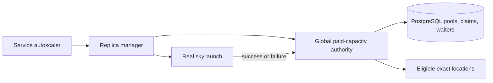
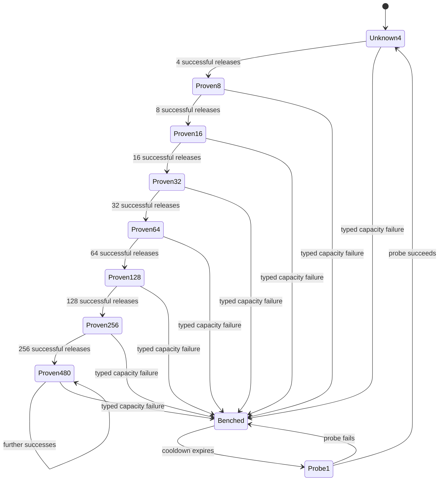

# SkyServe Global Paid-Capacity Authority

_Created: 2026-07-22_
_Expanded: 2026-07-23_
_Last updated: 2026-08-26_

## Status

The depth, service-envelope, accelerator-frontier, priority, and durable
provider-feedback policy in this document is deployed and remains
authoritative. A 2026-08-26 GCP qualification exposed a transaction-cardinality
defect below that policy: a nominal 100-wide wave persisted each paid replica
in its own transaction, and every committed provisioning row advanced the
projected route before the remaining prospective claims could commit. GCP
usually produced a `RUNNING` VM 10-30 seconds after commitment, but repeated
route-plan self-invalidation stretched 100 Spot L4 VMs to 27 minutes 53
seconds.

The active amendment changes paid claim acquisition from N singleton commits
to one bounded PostgreSQL transaction for the accepted batch. It does not
increase any default bound. Unknown pools still begin at four, the cold
service envelope remains 16, the normal per-card frontier remains two, and all
priority, price-order, cooldown, adaptive-depth, worker, and Spot-only gates
still clip the batch. The transaction inserts only the accepted replicas and
their paid claims. It deliberately does not create a second request-admission
protocol: after commit, the existing generic non-pool path binds each replica's
association, immutable API request, queue row, and retention pin, and the
existing launch-reservation batch charges process capacity before workers
start. The new transaction may use advisory process headroom only to bound its
prepared size; Phase B remains the sole P authority and may leave committed
`SCHEDULED` rows inert. A row between those boundaries cannot make a provider
call. The deployed `1.1.1507` singleton path is safe but is not the final
throughput contract.

The PostgreSQL global paid-capacity authority shipped with database migration
027. PR #909 reduced its exact-pool bootstrap from 60 to four, added a sticky
failure cooldown and one-probe recovery, bounded controller submission by API
worker capacity, and corrected dashboard lifecycle semantics. It passed the
full PR suite, including the required real-PostgreSQL lane, and shipped as
image and chart 1.1.759 from merge
`1f0bc56953ecc7d7366f7f6858234ea751c2cf98`.

The first production cycle exposed a second-order amplification across exact
pools: after the inherited 72-claim legacy cohort drained, one service acquired
49 unresolved claims across 28 independent pools (four claims in seven new
pools and one probe in 21 previously failed pools). The exact-pool invariants
held, but their sum was still too large for one service. A separate
12-replica `boltz-l4-fleet` wave was durably pinned across six exact paid pools
before any provider result returned: four replicas in each of two GCP zones
and one probe in each of four AWS pools. The four-wide depth bound worked, but
temporary saturation was still interpreted as permission to spill, so a large
cold wave could touch `ceil(target / 4)` pools.

PR #915 merged the first breadth guard as
`c249e39368edfa98d7de240716ce88721d1da909`: an atomic, default 16-claim
per-service envelope across every paid pool and accelerator shape. It passed
the full suite, including the real-PostgreSQL lane. Image and chart 1.1.768
were published, and that correction was subsequently deployed in release
1.1.769 at Helm revision 254. The live controller adopted an inherited
27-claim overage and admitted nothing while over limit; after normal outcomes
reduced the cohort to five, it acquired exactly the 11 remaining slots and
stopped at 16 total.

PR #926 subsequently merged the zero-cost liveness correction as implementation
commit `dbbe1ab3f` and merge commit `8eab90191`: exhausting the paid service
envelope must not suppress a compatible zero-cost launch. The frontier
correction is rebased on that merge. It retains the logical paid-only precheck
and implements the physical requirement through a full pass with exact-override
memoization, so a blocked paid entry cannot hide later reserved-fill or pinned
work. The earlier production 1.1.769 evidence below predates PR #926 and
validates the paid envelope, not zero-cost progress while that envelope is
full. Release 1.1.776 contained both corrections.

The bounded-exploration correction layered a default two-pool frontier
per exact accelerator card on top of that deployed service envelope while
retaining the adaptive exact-pool depth authority. PR #928 passed every visible
check, including the required real-PostgreSQL lane, and merged as
`1cea872fe2d83afa676e7a11d12f8c1dfb8dbca7`. Image and chart 1.1.776 were
published and were deployed at Helm revision 258. That historical post-rollout
database snapshot satisfied the exact-pool, 16-claim service, and two-pool card
bounds with no unattributable unresolved row; the API, service controller, and
both load-balancer slots were healthy. A natural `boltz-l4-fleet` scale-up wave
had not occurred at that snapshot. Later 1.1.789 evidence below records a
natural bounded wave and typed provider-capacity failure.

The 2026-08-01 follow-up adds a delayed, target-backed third-region
exploration step without widening the 16-claim service envelope. It is not yet
production-validated. Its rollout begins with the maximum held at two, then
canaries three for one isolated service before broader activation.

This follow-up shortens the terminal provider-feedback path without changing
admission bounds or durable state. A launch worker that receives a typed,
terminal capacity or quota failure reports that result to the replica manager
before starting controller-side cluster teardown only after provider failover
cleanup completed successfully or the backend proved that no provider nodes
were created. On the manager's next refresh, the existing atomic outcome
transaction closes the exact pool and releases the claim before the existing
idempotent replica teardown reconciles any control-plane leftovers. Retriable
attempts, cleanup-uncertain failures, and untyped terminal failures retain
synchronous cleanup. PR #937 passed its release gates and merged as
`408fd62cd931db854551c9c06d47b474309ddd4b`; release 1.1.784 deployed at
Helm revision 261 and validated the direct typed-error path.

Production verification of that follow-up exposed an evidence-preservation
gap below the launch worker: the per-zone provisioning loop recorded a
structured AWS `InsufficientInstanceCapacity` failure for its local cache and
event history, then raised a new terminal `ResourcesUnavailableError` without
the provider failure in its nested failover history. The Serve classifier
therefore conservatively treated the terminal wrapper as untyped and did not
refresh the durable paid-pool cooldown. The correction preserves every
per-zone provider exception in the terminal wrapper. Mixed or unknown
histories remain unclassified; only the already-recognized structured
capacity/quota codes reach the durable outcome path.

PR #939 preserved that per-zone provider evidence and merged as
`5d5c04e41fab0066b06dfe07f9636ab1b8113d84`. Release 1.1.786 deployed at
Helm revision 263, where natural terminal provider failures still did not reach
the typed outcome/pool-close path. Code-path analysis and the end-to-end
provisioning regression identified an additional optimizer-exhaustion wrapper
as the cause, motivating the recursive contract below.

The normal cross-location path adds another terminal wrapper when optimizer
exhaustion follows a per-location failure. Provider evidence may therefore be
nested through more than one `ResourcesUnavailableError.failover_history`.
Classification recursively traverses those histories to their leaves instead
of inspecting only the immediate list. A `ResourcesUnavailableError` with a
nonempty history is an internal node: its history children are the
authoritative attempts, and its own summary and explicit cause are not an
additional leaf. One with an empty history, or any other exception, is a leaf
classified through its explicit cause chain.

Each leaf still requires recognized, provider-scoped structured codes. GCP's
uninformative `VM_MIN_COUNT_NOT_REACHED` summary is neutral only while
classifying GCP; seeing it in an AWS result remains unknown. Any unstructured
or unknown leaf, history container whose exact type is not the built-in
`list`, malformed history entry, failover-history cycle, explicit-cause cycle,
mixed graph that reaches a history-bearing wrapper through a leaf's cause
chain, excessive depth, or overflow of the total history-and-cause node budget
keeps the whole terminal result untyped; error text is never parsed. The
implementation fixes the maximum depth and total node budget as constants,
preflights each history fanout before enqueueing its children, and tests both
deep and shallow-wide overflow. If every leaf is recognized, quota dominates
a mixed known capacity/quota history and otherwise the result is capacity.
This recursive contract applies equally to AWS and GCP and changes neither
provider cleanup nor controller-side teardown ordering.

PR #941 implemented that recursive contract, passed every visible check, and
merged as `5f1f30fceac3c5fbb266a1812b32f6d747fe7eb1`. Image and chart 1.1.789
were published from that exact commit and deployed at Helm revision 264 with
existing values reused and explicit API/init-container image overrides. The
API, migration job, service controllers, and Protenix external load balancer
recovered successfully. The declarative production pin merged in boltz-platform
PR #7298 as
`83ade2b76d979f7899d8a2f67bad7fc07da1d60c`. A natural production
provider-capacity failure subsequently exercised the nested classification,
atomic pool-close transaction, and teardown ordering within one bounded
controller refresh. Two other AWS `InsufficientInstanceCapacity` results
closed their exact PostgreSQL pools and released their claims; a controlled
API-server restart retained both failure epochs and zero-claim state, proving
the cooldown authority is durable rather than process-local.

Release 1.1.791 subsequently superseded 1.1.789 in production at commit
`0bcde60a768ec262f2a14f58c3af49c65aaeaa15`. It retains the complete recursive
classifier and paid-capacity authority while adding the separately reviewed
per-worker pool Spot-fallback change from PR #945. Boltz-platform PR #7300
merged the 1.1.791 production pin, and separately enabled the existing Jobs
consolidation mode, as `4d08a9b6a1`; PR #7301 reconciled the declarative state
PVC with its already bound 200 GiB capacity as `ae271dccf0`, and PR #7303 added
a regression guard as `fa465977e3`. The final Terragrunt reconciliation
deployed Helm revision 269, completed seed job
`skypilot-seed-config-2120d2f60359`, restarted the API server, and converged to
a zero-diff plan. The production API and every external load-balancer slot now
run the 1.1.791 image at digest
`sha256:a47d7c4135fa540fef709bb73a539749f92de69434b3bfb97bd7cdc61304be06`.
Post-restart evidence below confirms that the 16-claim service envelope and
two-pool per-card frontier remained active under a natural L4 scale-up wave.

## Problem

SkyServe can persist a large missing-capacity wave before any provider launch
returns. Dynamic fallback placement deliberately selects the cheapest active
location until provider feedback benches it. Without a bound, hundreds of
PENDING replicas can be pinned to one unverified Spot zone. With a small fixed
per-service bound, large waves spill across many regions before feedback even
when the cheapest provider pool is deep.

The original paid placement cohort bounded each exact `Location` at four
unresolved launches. A later global authority changed the cold cohort to 60 so
a target of hundreds would not traverse the configured AWS and GCP region set
too quickly. Increasing a per-service constant alone left two structural gaps:

1. Multiple services can each spend the full allowance against the same pool.
2. Recent real successes do not increase the depth assigned to a proven pool.

Before the global-authority extraction, policy, parsing, accounting, and
selection glue lived inside `replica_managers.py`, mixing cross-service
capacity authority with per-service replica lifecycle management.

Production evidence showed two exact-pool gaps in the global implementation:

1. A cold exact pool may submit all 60 claims before the first provider result.
   In one observed pool, 24 requests succeeded and 43 then failed after the
   pool exhausted. The failure reset the next cohort but could not retract the
   already submitted siblings.
2. Failure timestamps survive in PostgreSQL, but placement admission ignores
   them. Controller or API-server restart reconstructs a fresh process-local
   placer and retries exact pools that failed minutes earlier.
The v1.1.759 correction addressed those exact-pool gaps and exposed a third,
cross-pool gap: depth and breadth are independent controls. Per-exact-pool
limits compose additively, so a large catalog can submit a small cohort or
probe in many pools at once. Production observed 49 unresolved paid claims for
one service even after every individual pool obeyed the corrected four-or-one
bound. The manager persists the full wave before launch workers start, removes
each pool from the candidate set after four claims, and immediately selects
the next pool. Those PENDING rows then count as committed target capacity, so
later success-driven 4, 8, 16 ramping cannot pull them back into a deep pool.

SkyServe also has two independent concurrency layers. A replica becomes
PROVISIONING when its local launch thread submits a long API request, while
the API server may still be waiting for a long worker. In the observed
deployment, SkyServe admitted up to roughly 330 launch threads while the API
server had 128 long workers. The dashboard then described durable intent,
API-queued work, provider provisioning, and retained failure history as
machines or provisioning capacity. At the incident peak the history showed
more than 1,300 provisioning replicas, while the provider-facing cohort was
bounded independently and many rows were still queued intent.

## Goals

Fresh paid demand placement keeps cheapest-first economics while limiting the
combined unresolved work sent by all service controllers to one exact provider
pool. Unknown pools start at four claims. Genuine successful launches expand
the shared limit through 8, 16, 32, 64, 128, 256, and 480. A typed provider
capacity failure immediately closes the pool to new claims for ten minutes.
After the cooldown, one shared probe is allowed; its success reopens the
four-wide cohort and its failure restarts the cooldown. Stale positive evidence
also returns the pool to the four-wide cohort.

The exact-pool bound remains deliberately per instance type rather than per
zone. It is nested inside two complementary breadth controls. First, a service
may hold at most 16 unresolved paid claims across every exact pool and
accelerator shape. Second, each service and exact accelerator card may own at
most two unresolved paid pools by default: a primary plus one hedge. Once both
frontier slots are owned, additional demand for that card normally waits for
provider feedback. If every owned pool lacks headroom and each has remained
unresolved for a bounded delay, one reconciliation wave may open a third pool
in a new provider-region failure domain. The default maximum is three.
Different cards have independent frontiers but share the same 16-claim service
envelope.

The three controls compose without replacing one another. The exact-pool
authority limits global unresolved depth across services and retains its
4, 8, 16, 32, 64, 128, 256, 480 success ladder. The service envelope limits
one service's total unresolved latency. The card frontier limits placement
fragmentation. Whichever control has no remaining headroom stops a fresh
claim. Successful launches release service claims immediately and let later
cohorts deepen a proven owned pool, so neither breadth control limits total
fleet size, steady-state throughput, or the exact pool's learned ceiling.

Only a durable launch outcome releases a claim; process-local bench, catalog
state, and teardown completion cannot erase frontier ownership. For a typed
terminal capacity or quota failure, worker completion makes the outcome
eligible for the manager's next atomic refresh even if controller-side
teardown is still pending. That transaction closes exact-pool admission and
releases the failed claim. Its frontier slot advances only after every
already-unresolved sibling in that pool receives a durable outcome.

Saturation caused solely by another service does not consume this service's
frontier and may be skipped. This prevents cross-service head-of-line blocking
while keeping one service's own cold wave bounded. Different exact accelerator
cards have independent frontiers, so an A100 probe cannot block unrelated L4
demand, unless the shared 16-claim service envelope is already exhausted.

In consolidation mode, the default global Serve submission bound must not
exceed the API server's guaranteed long-worker parallelism. This prevents a
large hidden API queue while retaining concurrency across independent pools.
An explicit `SKYPILOT_SERVE_OVERRIDE_CONCURRENT_LAUNCHES` remains an operator
escape hatch.

The shared authority must be atomic across HA controllers, survive process
restart, preserve request priority for new claims, remain non-preemptive, and
upgrade cleanly while old controllers and unresolved pre-migration replica rows
still exist. This authority is a central-server PostgreSQL feature. A local
SQLite controller keeps the existing per-service launch window and never
enters the shared claim protocol.

Paid-capacity policy and persistence integration live in a focused central
module. `replica_managers.py` consumes its interface without owning the policy.

## Non-Goals

The authority does not launch disposable probe machines, reserve provider
capacity, predict future provider inventory, migrate READY replicas between
regions, change accelerator compatibility allocation, or replace the spot
placer's cost ordering and bench semantics.

Delayed frontier expansion does not increase the autoscaler's target and does
not persist speculative capacity beyond current demand. Every claim, including
one in the third pool, is backed by existing target shortfall and remains
inside the service-wide unresolved-claim envelope. Probabilistic target
overshoot and early retirement of excess successful machines require a
separate design and rollout.

It also does not serialize the whole fleet, add arbitrary sleeps between
healthy independent launches, cancel requests that may already be mutating a
provider, or treat a broad region as unavailable because one exact instance
type failed.

## Background

An unresolved paid launch is a valid durable paid claim whose matching replica
for the current service incarnation is PENDING or PROVISIONING. It continues
to consume exact-pool, service-envelope, and card-frontier admission when its
pool is benched or disappears from the active catalog. Zero-cost and other
exempt rows without a paid claim do not consume this authority. STARTING,
READY, and NOT_READY replicas prove provider capacity was acquired and release
their claim.

The manager reconstructs an advisory wave-local budget from durable service
claims and the central pool snapshot. Selection filters locations with
remaining allowance, then delegates to the concrete `SpotPlacer` dynamic
engine, which chooses the cheapest active candidate. The budget is debited
after an atomic central claim succeeds. It paces one wave but is not the
concurrency authority;
the service-and-pool transaction provides safety across services and controller
processes. Before that central transaction existed, the same manager-local
budget was safe only within one manager lock.

SkyServe already stores HA-fenced service state and reserved-capacity
arbitration in the central Serve PostgreSQL database. Provider launch outcomes
are observed in `_refresh_thread_pool()`, where the local placer is activated
or benched before completed replica rows are persisted.



## Behavior Contract

### Scope

The global paid authority applies to fresh demand launches and fresh
cost-rebalance replacements at non-zero-cost locations. It does not constrain:

- zero-cost reserved-capacity demand or fill;
- recovery re-drives with an immutable persisted location;
- services without a spot placer.

These exclusions apply to actuation, not only accounting. Exhausting the paid
service envelope or one card's frontier suppresses only fresh paid placement.
It never terminates zero-cost reserved demand or fill, and it never terminates
a durable cost-rebalance replacement already persisted with its selected
location and paid claim. A physical wave stops only after a complete pass makes
no progress through those unconstrained paths. Logical exact-card loops
likewise continue evaluating and placing zero-cost capacity even when paid
admission for the service or card is closed.

`service_exhausted()` is an advisory classification: it is true only when a
finite fresh-paid service headroom is less than or equal to zero. A `None`
legacy budget is not exhausted, and a true result never means “terminate the
scaling wave.” Logical reconciliation may use it to pre-defer only an exact
card whose current override is proven to have no compatible active zero-cost
location, then continue later cards. A compatible active zero-cost candidate
still proceeds through the normal broker, grant, and reconciliation-fence
checks; the precheck preserves that opportunity but does not guarantee a
launch.

A recovery-pinned unresolved paid row, including a cost-rebalance replacement,
still counts against exact-pool, service-envelope, and card-frontier capacity.
It does not acquire a second claim. Its durable claim is immutable to the exact
pool selected before the restart: a retry against that same pool is idempotent,
while a retry naming a different pool fails before candidate-pool, waiter, or
replica mutation. See `serve-restart-safe-cost-rebalance.md` for the
replacement protocol.

Fresh claim acquisition is blocked once a service enters a launch-blocking
status. Adoption and launch-outcome persistence remain allowed for the same
fenced service incarnation during shutdown and failed cleanup so the controller
can release claims, persist final rows, and finish teardown. A refresh tick
with no completed launches performs no paid-capacity database write.

### Exact pool identity

`PaidCapacityPoolKey` is a deterministic, versioned value containing:

- credential workspace;
- cloud;
- region;
- zone;
- exact instance type when catalog resolution provides one;
- accelerator model and count;
- Spot mode; and
- node count.

The key deliberately excludes image, disk tier, application configuration, and
service identity because those do not identify provider capacity. Provider
account IDs may be attached to outcome observations later, but must not appear
in user-visible logs or replica rows.

`spot_placer.Location` retains the resolved instance type so two catalog shapes
that consume different provider pools cannot share claims accidentally.
Instance type participates in location equality and hashing. A legacy location
without an instance type maps to a current location only when every other
shape field matches and exactly one current instance type is possible.
Ambiguous legacy locations are skipped rather than guessed.

Catalog-resolved instance types remain independent placement candidates.
Selection therefore may try a second exact type in the same zone before a
costlier region, when its normal per-GPU cost ordering says so. The launch is
pinned to the selected type because an unpinned provider fallback could consume
a different pool than the claim. A capacity failure benches only that exact
type/location candidate, leaving other types in the same zone eligible. This is
an intentional extension of provider-pool depth, not accidental duplicate
enumeration.

During a mixed-version rollout, legacy rows without `instance_type` remain
strictly unresolvable for shared-claim attribution when several current types
match. Operational placement behavior uses a separate temporary compatibility
fallback: local bench, activation, cost, and queued-launch admission resolve
such a row to the cheapest otherwise-equivalent current type. This preserves
pre-upgrade progress without guessing a global claim identity.

Once an attributable replica has a durable paid claim, compatibility fallback
and refreshed catalog ordering no longer participate in recovery placement.
The claim's exact pool key is authoritative for every re-drive. Reusing the
same replica identity and pool key is idempotent; presenting a different pool
key is a consistency failure before candidate-pool, waiter, or replica
mutation, not permission to migrate the unresolved launch.

### Central claims

The central database contains one pool row per exact key and one claim row per
service incarnation and replica ID. The service row serializes the per-service
envelope and per-card frontier; the pool row serializes the exact-pool limit.

Claim acquisition uses this bounded-batch transaction protocol:

1. Before the transaction, the existing placer freezes an ordered candidate
   for each logical slot from one advisory budget. Each candidate has one exact
   location, pool key, replica/record identity, priority, width, and immutable
   plan debit. No replica is prepared for two alternative locations, and a
   rejected identity is never reassigned inside the transaction.
2. Acquire the zero-cost protocol observation lock, lifecycle row, and service
   owner row in the deployed paid-admission order. Read an advisory claim
   snapshot only to discover every retained pool that must join the sorted lock
   set; do not prune or otherwise mutate claim/waiter state yet. Bound the
   prepared set by the caller's configured batch maximum. Process headroom is
   advisory here; only the later P transaction authoritatively limits started
   workers. A normal cold service therefore cannot acquire 100 merely because
   100 were prepared.
3. Ensure and lock every distinct pool named by a candidate or the advisory
   retained-claim snapshot in canonical pool-key order. Only after all those
   locks are held, authoritatively reread and prune stale claims, reconstruct
   per-card ownership, and clip accepted members at the configured service
   envelope and global paid-GPU cap. Under the same locks, apply
   positive-evidence expiry, adaptive pool depth, accelerator frontier, and
   priority waiter ordering. Exact-pool saturation defers that
   member but permits later already-prepared members for distinct logical slots
   to continue in frozen cheapest-first order. A higher-priority waiter or a
   full frontier stops later candidates for that accelerator card; service or
   paid-GPU saturation stops the wave. No rejection selects a new alternative
   in-transaction. The next fresh tick may place only never-committed slots.
   The transaction refreshes each denied pool's waiter with its existing
   `first_wait_at`/TTL semantics. If one pool is acquired and then saturated by
   a later member in the same batch, the final saturated waiter refresh wins
   over the earlier acquired-waiter removal. Cross-pool cleanup remains the
   established postcommit service-row-only transaction.
4. Exact-match the current demand, route, reserved allocation, capacity graph,
   and one capacity-plan authority once per distinct debit card in the same
   transaction. Sum all accepted incoming units by card before its validation
   against existing same-plan claims. A stale graph or insufficient residual
   rejects the transaction; it never preserves candidate identities across a
   refreshed plan.
5. Insert the accepted policy-valid subset's replica rows and paid claims in
   deterministic order with `sky_launch_status=SCHEDULED`, then commit before
   registering or starting any launch worker. An insert error rolls back every
   new replica and claim in the subset. No batch table, association, request,
   queue row, retention pin, or execution claim is added by this transaction.
   Any plan-freshness conflict, ownership loss, SQL error, or member-insert
   error rolls back every Phase-A mutation, including waiter changes and pool
   evidence normalization. A deliberate policy denial may commit waiter-only
   state; a successful subset commits its final per-pool waiter effects with
   its replica and claim rows.
6. After commit, the manager registers the already-built ordinary launch
   workers. The existing launch-reservation transaction charges the process P
   budget in a batch, and each worker uses the canonical generic non-pool
   binding path before provider I/O. A crash anywhere after the claim commit
   leaves ordinary unresolved replica rows that recovery exact-matches by
   replica identity. An association-less Phase-A replica+claim pair has no
   provider-effect authority: recovery atomically retires the pair with the
   existing proof-backed pre-admission primitive, wakes reconciliation, and a
   fresh plan may mint a new identity. If binding won the row-lock race,
   recovery adopts the exact association and request instead of retiring it.

The returned result names the committed members and each typed deferral. A
lost transaction acknowledgement is not inferred from a nonexistent batch
manifest. The caller fails closed and enqueues only the frozen member
identities for supervised reconciliation after releasing the manager lock.
That pass retires and replans exact association-less pairs, adopts exact bound
pairs, and treats absent identities as no-ops. It retries transient failures
without touching unrelated locally queued work. Startup recovery applies the
same per-identity rule after process death. PostgreSQL cannot expose a partial
transaction; mixed replica/claim state is corruption, not an ordinary
`AMBIGUOUS` result.

The lock order is zero-cost protocol observation, lifecycle row, service owner
row, distinct paid pool rows sorted by canonical key, plan/demand/report/route/
allocation/capacity rows, and member replica/claim rows in deterministic order.
Outcome and release transactions retain service-before-sorted-pools ordering.
Request binding is a later transaction and therefore cannot invert paid-pool
locks. The post-commit waiter cleanup remains deliberately service-row-only.

Claims remain active while the matching durable replica is PENDING or
PROVISIONING. Success, failure, terminal transition, deletion, service
replacement, and purge release them. Reconciliation removes an orphan even if
a controller died between lifecycle steps.

A selection snapshot is advisory. Another controller can consume the final
slot between snapshot and persistence. The atomic claim result is
authoritative; a stale snapshot causes clean no-progress and retry, never
oversubscription.

### Adaptive depth

The default bootstrap limit is four. Operators may override it with the
positive-integer environment variable
`SKYPILOT_SERVE_PAID_LOCATION_LAUNCH_WINDOW`. Invalid or non-positive values
log a warning once per distinct value and fall back to four.

The per-service envelope defaults to 16 and is independently configurable with
`SKYPILOT_SERVE_PAID_SERVICE_LAUNCH_WINDOW`. Invalid or non-positive values
fall back to 16. It applies only to the PostgreSQL shared-authority path; local
SQLite preserves its existing compatibility behavior. An upgraded controller
adopts but does not cancel excess claims created by an older binary. Their
overage blocks new claims for that service until normal launch outcomes drain
the count to the envelope. This envelope does not clamp or reset a pool's
durable learned limit: multiple services can collectively exercise the same
pool's complete 4-to-480 ladder, while each service remains capped at 16
concurrently unresolved claims across all pools.

Every successful genuine provider launch releases its claim and increments the
pool's success count. When the count reaches the current limit, the authority
doubles the limit and resets the count:



The default maximum is 480 and is internally configurable with
`SKYPILOT_SERVE_PAID_LOCATION_MAX_LAUNCH_WINDOW`. Its effective value is never
below the bootstrap limit. Positive evidence expires after ten minutes without
a success. Operators may override this TTL with
`SKYPILOT_SERVE_PAID_LOCATION_SUCCESS_TTL_SECONDS`. Advisory snapshots evaluate
expiry without mutating state. Claim acquisition evaluates and persists expiry
while holding the pool lock.

A typed provider-capacity launch failure resets the learned limit and success
count to the bootstrap value and sets durable negative evidence. A non-null
`last_failure_at` is an uncleared negative epoch; a later
`last_success_at` alone does not reopen it. This sticky interpretation is
required for mixed-version safety because a revision-027 controller can admit
and record successes during the cooldown, but it never clears
`last_failure_at`.

While the negative epoch is active, the admission limit is zero until the
cooldown expires and one afterward. The cooldown defaults to ten minutes and
is configurable with the positive-integer
`SKYPILOT_SERVE_PAID_LOCATION_FAILURE_COOLDOWN_SECONDS`.

The one-probe bound is evaluated while holding the existing exact-pool row
lock, so it is global across services and controller processes. Existing
claims selected before the failure are not killed: some may already be inside
provider mutation, and unsafe cancellation can leak resources. They continue
to count against the probe limit until they resolve. This bounds a cold
failure's newly submitted siblings to the bootstrap cohort and prevents new
cohorts after evidence arrives.

When the first post-cooldown claim is acquired under the pool lock, the
authority persists `current_limit=1` as a probe marker. Only a success from a
claim selected after `last_failure_at + cooldown`, observed while that marker
still holds, may clear `last_failure_at`, restore the bootstrap limit, and
record new positive evidence. An old binary never clears the negative epoch.
If it overwrites the marker during a mixed rollout, the result is
conservative: the success cannot reopen the pool and a later new-code probe is
required.

Unknown, application, configuration, control-plane, and ownership failures
release their claims without changing shared provider-capacity evidence. The
manager may retain its existing conservative local bench and queued-sibling
invalidation behavior for an unknown failure, but that local fallback is not
evidence strong enough to poison a pool shared by other services. Outcome
processing compares each claim's selection timestamp with the pool's latest
failure timestamp and cooldown boundary, so a slower success selected before a
newer failure cannot undo that failure or reopen global admission.

Correctness timestamps come from PostgreSQL `clock_timestamp()` sampled after
the transaction acquires the exact-pool row lock, not from a controller's
`time.time()` and not from transaction-stable `CURRENT_TIMESTAMP`. A
transaction may begin before a failure, wait on its row lock, and enter the
critical section after it; only the post-lock wall clock preserves that
ordering. Claim timestamps are immutable after insertion. Mixed-version
adoption cannot prove when an old launch crossed selection, so adopted claims
use the conservative pre-evidence timestamp zero. They count against headroom
and may produce negative evidence, but their success cannot clear a negative
epoch.

The new four-based ladder is normalized lazily under the same pool lock.
Persisted limits that are not a rung of the configured ladder
`base, base*2, ... ceiling` reset to the bootstrap limit with zero accumulated
successes. With the default configuration this converts revision-027's
60/120/240 rungs to four while retaining a fresh, deeply proven 480 ceiling.
An explicit operator bootstrap such as 60 generates and preserves its own
60/120/240/480 ladder. Advisory reads apply the same conservative
normalization before showing headroom; atomic acquisition persists it. The
intentional `current_limit=1` probe marker is exempt while
`last_failure_at IS NOT NULL`: advisory state derives its zero-or-one effective
admission directly from the negative epoch and never normalizes the marker
away.

The implementation reuses revision 027's `last_failure_at`,
`last_success_at`, current limit, and claims. The sticky negative epoch and
one-probe marker refine previously advisory field semantics but need no new
column or migration.

### Bounded exploration breadth

The per-pool congestion window is a depth bound, not a fleet-distribution
policy. The 16-claim service envelope is a total unresolved-work bound, not a
within-card distribution policy. A third, nested bound limits how many active
paid pools one service may probe concurrently for one exact accelerator card.
The positive-integer environment variable
`SKYPILOT_SERVE_PAID_LOCATION_EXPLORATION_FRONTIER` controls the width and
defaults to two. Invalid or non-positive values fall back to two.

Two additional positive-integer settings bound delayed expansion. The
`SKYPILOT_SERVE_PAID_LOCATION_MAX_EXPLORATION_FRONTIER` default is three and
is clamped to at least the normal frontier. Setting it equal to the normal
frontier disables expansion. The
`SKYPILOT_SERVE_PAID_LOCATION_EXPLORATION_FEEDBACK_DELAY_SECONDS` default is
30 seconds. Invalid or non-positive values fall back to those defaults.

The frontier is reconstructed from every durable, valid PENDING and
PROVISIONING claim owned by the current service incarnation, including a pool
that disappeared from a refreshed catalog or was benched in one process. A
pool stops consuming a slot only when its claims receive an authoritative
durable outcome. Process-local catalog or bench drift cannot silently open a
third slot.

The canonical card key is the sorted set of case-folded accelerator model
names. Accelerator count and task node count deliberately do not participate:
L4:1 and L4:8 backends still explore the same L4 inventory class and together
consume one service's L4 frontier. Their distinct exact pool keys retain
independent depth and failure evidence. CPU-only demand uses an empty card key.
A valid unresolved claim whose legacy pool key cannot be parsed into a
canonical card counts conservatively against every candidate card frontier
until it receives a durable outcome; ambiguity fails closed rather than
opening an extra pool. Service-row-only waiter reconciliation consequently
evaluates all waiters and card frontiers, not only the card that triggered it.
Unknown or malformed owned pool keys participate in every card's owned count,
so when they fill another card's frontier, that card's waiters outside the
durably owned exact-pool set are withdrawn too.

The selection budget applies that durable ownership to the active locations
compatible with the current exact-card batch:

1. If the configured service envelope (16 by default) is exhausted, the batch
   stops fresh paid selection regardless of card or pool headroom.
2. If fewer pools than the configured frontier (two by default) are open for
   the card, normal cheapest-first selection may open another pool. When an
   owned pool already exists, selection prefers an unowned pool in a new
   provider-region failure domain when one is available, then preserves the
   existing same-domain fallback.
3. Once the configured frontier is full, selection is restricted to its owned
   pools while any has headroom.
4. If every owned frontier pool is at its admission limit, the budget may
   expand that card's effective frontier by one, up to the configured maximum,
   only after every unresolved claim in every owned pool has aged past the
   feedback delay and an active unowned candidate exists in a provider-region
   not already represented by the owned pools. Unknown pool identity or claim
   age fails closed. One budget may expand a card at most once.
5. If delayed expansion is ineligible, the batch stops and leaves the
   remaining paid target as autoscaler shortfall. It does not persist more
   fresh paid PENDING rows elsewhere.
6. A completed launch releases only its own claim. Success keeps the location
   active and lets the normal 4, 8, 16 ramp deepen it on the next
   reconciliation tick, subject to the service envelope. A durably persisted
   typed failure closes admission to the pool, but unresolved siblings may
   already be mutating the provider and continue consuming the same frontier
   slot. The slot frees only after the last sibling receives a durable outcome
   or is authoritatively removed.
7. A pool filled entirely by other services is not owned by this service and
   may be skipped.

The failure-domain key is the case-folded cloud name plus region. Zone and
instance type remain part of the exact pool key but do not make two candidates
regionally independent. Pool keys outside the active catalog still contribute
their parsed failure domains. Any unknown or malformed owned pool prevents
delayed expansion for that card because the controller cannot prove that a
candidate is independent.

Claim age is advisory pacing, not a lease. The selection snapshot reconstructs
the newest unresolved creation time for each owned exact pool and expands only
when the youngest unresolved claim across the entire owned cohort has also
waited the configured delay. Controller wall-clock skew can delay or
accelerate the advisory choice, but it cannot break an admission bound: the
service-row-locked claim transaction re-reads current ownership and atomically
enforces the candidate card's effective frontier before touching the pool row.

Here, “batch stops” applies only to fresh paid admission. It is not a
control-flow break for the whole scaling pass. The physical placement loop
continues zero-cost reserved demand, reserved fill, and durable recovery-pinned
cost-rebalance replacements, and terminates only after a complete pass makes no
progress through any of those paths. Logical exact-card reconciliation
similarly retains zero-cost candidates and may satisfy one or more card targets
even when the paid service envelope is exhausted or that card's paid frontier
is feedback-deferred. Within one physical batch, a frontier, priority, or
service-envelope stop memoizes only the exact fresh-demand resources override
that encountered it. Later equivalent paid decisions are skipped without
repeating selection or central admission, while different card overrides,
reserved-fill sentinels, and rebalance overrides are still examined. A fresh
rebalance override is exact-location pinned but still acquires paid admission;
only a recovery row that already owns a durable claim bypasses new admission.
The wave-local stop sequence advances even when the relevant envelope or
deferral marker existed before the batch, so a recovered full service or
already-deferred card performs one no-progress selection rather than scanning
hundreds of equivalent target entries.

The selection snapshot combines PostgreSQL global pool headroom with the
current service's remaining 16-claim headroom and durable replica rows to
reconstruct owned claim pool keys, including keys outside the active catalog.
The wave-local budget decrements service headroom and increments its owned set
after every accepted claim, so a single large batch cannot outrun either
snapshot.

The snapshot is not the concurrency authority. The atomic claim transaction
first locks and validates the current service incarnation, discovers every
candidate and retained service pool, locks those pool rows in canonical sorted
order, and only then prunes stale claims. It evaluates the frozen members in
order against the re-read service envelope, each candidate card's effective
frontier, exact-pool depth, and priority. This serializes overlapping batches
and old/new controller handoff even when they select different pool rows, so
two stale snapshots cannot open both a third and fourth pool.

Priority waiter refresh and exact-pool evaluation happen while all named pool
rows are locked. A saturated member may leave a waiter and later independent
members may still acquire; a frontier or higher-priority deferral stops only
that card, while a service-wide limit stops the wave. An acquisition that
fills a frontier commits the selected replica+claim subset first, then uses
the separate service-row-only cleanup transaction described above to evaluate
every waiter/card and delete waiters outside each now-owned set. Unknown or
malformed owned claim keys count against every card during that reconciliation.
No postcommit cleanup transaction holds a pool row. If cleanup fails, the
already committed subset remains authoritative and the 45-second waiter TTL is
the bounded fallback.

PENDING and PROVISIONING claims intentionally have no age-based expiry:
automatically releasing one while its provider mutation is ambiguous could
over-launch outside the frontier. The policy fails closed if every frontier
cohort hangs. Normal launch attempts are bounded to three, and spot capacity
failures to one; their completed outcomes release claims. A terminal typed
failure is reported before controller-side teardown only when the API backend
completed provider failover cleanup successfully or proved that no nodes were
created. Provider cleanup retries and verification are part of the typed-error
boundary: cleanup uncertainty remains an untyped error such as
`StopFailoverError`, retains the durable claim, and follows synchronous
controller cleanup instead of this fast-feedback path. After the manager
persists a typed outcome, its existing `_terminate_replica()` path performs
idempotent control-plane cleanup and state reconciliation. Retriable attempts
still terminate synchronously before retrying the same replica, and all
untyped terminal failures still terminate synchronously before returning
because they do not carry authoritative provider-availability evidence.

The outcome transaction is also the lifecycle fence for crash and ownership
races:

- Before it commits, a controller crash or ownership handoff leaves the
  PENDING or PROVISIONING row and claim intact. The successor re-drives that
  same replica at the same exact pool; it cannot infer or publish the stale
  worker's process-local typed result.
- After it commits, the row durably records the failed launch and no longer
  owns a paid claim. A crash before `_terminate_replica()` leaves cleanup
  incomplete; recovery derives `FAILED_CLEANUP` and
  `_reconcile_failed_cleanup()` re-drives teardown without launching a
  replacement from that failed row.
- Cancellation or scale-down that changes the replica lifecycle before the
  outcome commit owns cleanup. A stale worker or stale controller may not
  publish typed pool evidence after that transition. Ownership-fenced
  persistence rejects an old controller atomically.

On controller/API restart, recovery adopts and re-drives every durable PENDING
and PROVISIONING row with the same cluster, replica, exact-pool, and claim
identity. The persisted resources override and paid pool key pin the re-drive;
catalog refresh cannot select a replacement pool. A same-pool retry is
idempotent, and the service-locked persistence guard rejects a cross-pool retry
before candidate-pool, waiter, or replica mutation. A request that remains
hung without process failure requires operator investigation and controller
restart; frontier-full logs include oldest-claim age so this condition is
alertable. The rollout gate exercises restart with a full frontier and proves
same-pool re-drive without opening another pool.

The bound applies to concurrently unresolved exploration, not lifetime or
READY fleet diversity. Once every unresolved sibling in a durably failed pool
drains, the frontier can advance through several pools over time; a late
sibling may still succeed after its pool has been closed. Those cases remain
visible in placement-spread metrics and do not justify revoking live replicas.

This is just-in-time placement: only work admitted by both the service envelope
and bounded exploration frontier is durably pinned. The existing global worker
ceiling still limits how many accepted rows can enter provider execution, but
it is no longer the first place an oversized wave is bounded. No schema
migration is required because service identity, pool ownership, card identity
inside the versioned pool key, provider-region identity, and claim age are
already durable in `paid_capacity_claims`. A restart reconstructs an existing
three-pool cohort from its claims. It may continue using those owned pools, but
cannot open a fourth when the configured maximum is three.

Kubernetes zero-cost placement is deliberately separate. With a healthy
capacity observation it already uses measured free GPUs, distinguishing a
cluster with four free GPUs from one with 400. Its four-probe speculative
fallback applies only while that observation is unavailable and is unchanged
by the paid-cloud exploration frontier.

### Submission concurrency

`PENDING` and `PROVISIONING` claims remain part of paid-pool accounting, but
the 16-claim service envelope is independent from the process submission
ceiling. In consolidation mode the latter is:

```text
min(
  service-memory-derived launch bound,
  API-server guaranteed long-worker parallelism,
)
```

The API startup calculation is authoritative. After computing
`ServerConfig`, the supervisor publishes the actual
`long_worker_config.garanteed_parallelism` into the clean immutable environment
captured for consolidated controller children. Controllers do not recompute it
from potentially different process environments, reserved-memory inputs, or
resource views. A missing published value during mixed-version rollout
preserves the old bound until that controller is replaced.

The cap recognizes consolidation from the controller-process override and the
external-load-balancer Helm capability signal as well as the server config.
The per-service config snapshot intentionally omits the server's
`serve.controller.consolidation_mode` setting, so reading that snapshot alone
would silently leave production controllers uncapped.

The service envelope is authoritative at durable claim persistence, while the
worker ceiling includes zero-cost and lifecycle operations that do not consume
paid claims. Neither is proof that every submitted request is provider-active:
unrelated long operations can occupy workers. The explicit Serve launch
override remains authoritative for process concurrency, but it does not bypass
the paid service envelope or per-card frontier.

Non-consolidated controllers keep their existing local worker accounting.

### Operator-facing lifecycle

Existing public replica status values remain backward compatible. The
dashboard derives more truthful stages from status plus the already exposed
`launched_at` provider boundary:

- queued intent: PENDING, or PROVISIONING without `launched_at`;
- provider/setup in progress: PROVISIONING with `launched_at`;
- initializing/not ready: STARTING or NOT_READY;
- serving: READY;
- stopping: SHUTTING_DOWN or PREEMPTED;
- cleanup uncertain: FAILED_CLEANUP; and
- historical failure: other failed terminal states.

The regional view is labeled as tracked replica attempts, not machines. It
reports current-or-cleanup-uncertain and all-tracked totals separately.
Exact-card committed/unready capacity is redefined to include only PENDING,
PROVISIONING, STARTING, and NOT_READY rows. SHUTTING_DOWN and PREEMPTED are
stopping capacity, not future serving capacity; failed and cleanup-uncertain
history is also excluded. Exact-card labels use “committed/unready capacity”
rather than claiming every non-ready row is a provisioning machine.

The persisted exact-card `accelerator_breakdown` JSON adds a
`capacity_semantics_version` field without changing its existing LB
compatibility `version`. New samples use semantics version 2. Legacy samples
without that field counted stopping rows in `provisioning_capacity`; the
dashboard omits those old points from the committed/unready series and
explains the gap rather than relabeling them incorrectly. The aggregate
replica-history series is narrower and unchanged: it combines PENDING,
PROVISIONING, and STARTING while NOT_READY remains separate, so it is labeled
“committed/starting,” not “committed/unready.”

The selected service's summary, full replica snapshot, and history refresh
periodically with stale-response fencing; the page no longer freezes current
state after mount.

Shared-admission observability is deliberately aggregate and rate limited. A
controller logs pool-state counts, total active claims, effective admission,
remaining headroom, saturation, and legacy overage on a policy-state
transition, but never more than once per 30 seconds; an unchanged state is
reported at most once per five minutes. Pool keys and workspace identity are
not logged. A completed launch refresh emits one warning for the whole typed
provider-capacity failure wave, including only the failure and exact-pool
counts. Individual tracebacks remain in the bounded per-replica logs instead
of being repeated once per failure in the controller log.

### Priority

The autoscaler attaches the highest active request priority to each physical
scale-up wave. An instance-aware QPS wave is split into consecutive exact-card
batches and derives each batch's priority from request profiles compatible with
that card. An exact-card logical target carries the complete per-card map,
including explicit minimum-priority entries. Thus an A100-only priority-50
request does not promote an unrelated L4-only priority-20 launch. A request
with missing compatibility applies to every configured accelerator. Missing
or legacy priority evidence uses the minimum priority.

Priority is an admission hint, not a scale target. It is accepted only from a
complete fresh LB report and expires on the autoscaler's normal report
staleness threshold. Queue and compatibility gauges may remain conservatively
latched for capacity sizing, but stale evidence falls back to minimum priority
and cannot refresh a high-priority waiter indefinitely. If at least one valid
compatibility profile exists, aggregate queue priority is never used to promote
a card excluded by every profile.

Each saturated claim attempt publishes a short-lived waiter for its service
incarnation and pool. A lower-priority new claim defers while a fresh
higher-priority waiter exists. Equal-priority waiters are ordered by first
wait time. Existing claims, provisioning instances, and running replicas are
never revoked. Priority therefore controls only the next available claim.

Successful claims remove their service's waiter for the acquired pool inside
the admission transaction. Continued saturated or deferred attempts refresh
their heartbeat; an abandoned attempt stops refreshing and expires after the
45-second heartbeat TTL, configurable with
`SKYPILOT_SERVE_PAID_LOCATION_WAITER_TTL_SECONDS`. This prevents stale high
priority demand from starving peers without requiring durable scale-up wave
identifiers.
A batch locks the service row and then every candidate and retained exact-pool
row in canonical sorted order before refreshing or deleting any waiter or
claim. Frontier rejection is evaluated while those locks are held, and its
candidate waiters commit with the deliberate policy-denial result. A successful
subset commits first; when it fills the service envelope or a card frontier, a
separate follow-up transaction locks only the service row and performs
service-wide reconciliation. Unknown or malformed owned claim keys count
against every relevant card during both paths. The sorted-pool boundary
prevents cross-pool lock inversion, while the follow-up keeps global cleanup
independent from claim persistence. If the follow-up fails, admission still
returns `ACQUIRED`; the committed launch is not retried. The 45-second waiter
TTL is the bounded fallback for the abandoned waiter set.
A saturated pool may spill the wave to the next compatible paid pool. A
lower-priority claim deferred by an already-waiting higher-priority service
does not exhaust that pool or spill to a more expensive pool; it waits for a
later tick while preserving cheapest-first economics. The wave marks that
exact pool as priority-deferred. Later replicas in the same wave stop before
another database claim against the same cheapest pool. They do not filter the
pool out of paid candidates, which would incorrectly spill them to a more
expensive pool. Zero-cost capacity and independent exact pools remain eligible.

Saturation is evaluated before waiter ordering. A full pool always returns
`SATURATED`, allowing normal spill while retaining the published waiter for a
future slot. `HIGHER_PRIORITY_WAITING` is returned only when real headroom
exists but belongs to a better waiter. A physical wave stops further fresh paid
attempts against that deferred path so it neither repeats the database claim
nor consumes a benched location's one TTL retry probe, but still completes
zero-cost and durable recovery-pinned replacement work before declaring no
progress. Logical
exact-card reconciliation independently continues other card targets and
zero-cost placement for the deferred card.

### Upgrade and restart

There are four distinct mixed-version transitions.

The 2026-08-26 atomic-batch amendment adds no table, column, API payload, or
executor request shape. Service-owner fencing permits only one current
fresh-admission writer for a service, so a singleton and batch writer cannot
interleave for that service. The exact deployed `1.1.1507` cohort can decode,
adopt, bind, serve, and clean the unchanged rows; this is the required rollback
target. Broader N-1/N-2 authority remains exactly as declared by the umbrella
compatibility matrix: readable state is not permission for an N-2 writer to
start a provider effect.

Rollback is operational, not cleanup-only. A rollback may return new paid
admission to the slower singleton transaction, while already-committed
`SCHEDULED` replica+claim pairs continue through the same P reservation and
generic binding paths. The batch transaction is all-or-nothing, but no durable
manifest records its historical boundary. After a process death, a successor
enumerates complete inert replica+claim pairs individually. It atomically
retires and replans association-less pairs, and adopts only pairs whose exact
generic association already committed; it does not infer missing or deferred
members of the prior in-memory wave. A row has no queue visibility or
provider-effect authority until the later generic binding transaction commits.

Migration 027 creates empty additive pool, claim, and waiter tables. During a
026-to-027 rollout, each new controller transactionally adopts unresolved
paid rows belonging to its own service when their exact pool is attributable.
An old unkeyed row cannot safely be assigned to every exact pool, so it is not
globally debited from unrelated pools. Old controllers can still create
unclaimed rows and cannot participate in the new atomic claim protocol. The
hard cross-service bound therefore applies only after every active service
controller runs the new version and attributable rows have been adopted, or
ambiguous old rows have completed. This is a bounded rolling-upgrade condition,
not a steady-state relaxation.

The first correction rollout started from shipped revision-027 controllers.
Those controllers already created claims with the legacy 60-wide default,
ignored the cooldown, and could clamp a new controller's probe marker back to
their bootstrap. Sticky `last_failure_at` prevents their successes from
clearing a negative epoch, but their unresolved claims remain valid after
controller exit and recovery adoption. New controllers never revoke those
claims and admit no new work while their count exceeds the new effective
limit. The four-wide invariant became active only after all old controllers
exited, every exact pool's valid active claims drained to its new effective
limit, and the earlier 026-to-027 unattributable-row gate cleared.

The current breadth correction adds no schema. PR #915 controllers enforce the
16-claim service envelope but do not enforce the card frontier; v1.1.759 and
v1.1.760 controllers enforce neither breadth control. Combined-policy
controllers reconstruct both overages from valid claims and fail closed for
new work without revoking inherited replicas. The service and frontier
invariants become hard only after older controllers exit and their excess
claims drain, as detailed in Rollout and Rollback.

Revision 010 historically imported the live replica-row projection for its
pickle-to-JSON backfill. Revision 027 adds a current-schema field to that live
projection, which would make an upgrade replay of 009 to 010 attempt to write a
column that did not exist at revision 010. This implementation intentionally
corrects revision 010 in place by freezing the eight-field projection owned by
that migration, matching the already-frozen convergence projection in revision
026. No deployed revision identifier or stored data meaning changes.

For common catalog-expanded shapes, several instance types can match one old
row, so exact adoption may be unavailable throughout that row's remaining
lifetime. Those rows remain outside the hard global bound until completion.
Operational fallback keeps their queued launches and placement evidence moving
through the cheapest compatible current type. Rollout observability must report
the count of unattributable unresolved legacy rows before declaring the global
bound fully active.

Controller restart reconstructs wave snapshots from shared claims and durable
replica rows. It neither resets proven capacity nor acquires duplicate claims
for recovery-pinned replicas. The durable claim's exact pool and the replica's
persisted location must agree; recovery reuses them idempotently and fails
closed on any attempted cross-pool rewrite before mutating the candidate pool,
waiters, or replica row. Service recreation invalidates claims and waiters from
the previous service hash.

A schema/code rollback from revision 027 to 026 leaves the additive tables
unused. A later upgrade reconciles their rows against current service
incarnation and replica status. A correction-image rollback to shipped
revision-027 code is different: it continues using the tables with the old
60-wide, non-cooldown behavior described in Rollout and Rollback below.

Pool rows are small retained history keyed by configured exact provider pools.
Claims and waiters are reconciled or expired. Version one does not delete empty
pool rows because retaining ramp and failure evidence across an idle interval
is part of the policy, and the key set is bounded by catalog-expanded service
configuration rather than request volume.

The bootstrap default changes the historical scope of
`SKYPILOT_SERVE_PAID_LOCATION_LAUNCH_WINDOW`. On PostgreSQL it is the global
exact-pool bootstrap and now defaults to 4. On local SQLite it remains the
legacy per-service window, whose unset default is also 4. An explicit value
continues to configure both paths for backward compatibility. Operators that
previously set this variable retain their configured value and should review
the global cross-service scope before rollout.
Because local SQLite has no global claim identity, an ambiguous pre-instance-
type row conservatively debits the cheapest compatible exact type selected by
the operational rollout resolver.

## Central Module

`sky/serve/paid_capacity.py` owns:

- configuration parsing;
- exact pool-key construction;
- service-envelope and accelerator-frontier accounting;
- pure ramp, reset, and expiry policy;
- conversion of central state into location availability;
- pure selection-budget integration plus one-member and batch claim APIs; and
- outcome batching and redacted observability.

No new request-admission module or batch table is introduced. The batch is the
same paid-capacity authority already owned by `paid_capacity.py` and
`serve_state.py`, applied to an ordered tuple instead of one candidate.

The internal orchestration interface is:

```python
build_launch_budget(
    placer,
    workspace,
    existing_replica_infos,
    globally_managed,
) -> LaunchBudget

select_location(
    placer,
    budget,
    skip_zero_cost_preference,
    allowed_locations,
) -> Location | None

try_persist_claim_batch(
    service_name,
    service_hash,
    prepared_members,
    budget,
    controller_owner,
) -> ClaimBatchResult

try_persist_claim(
    ...,
) -> ClaimResult  # compatibility wrapper over a one-member batch

defer_for_priority(
    budget,
    location,
) -> None

defer_for_feedback(
    budget,
    location,
) -> None

exhaust_service(
    budget,
) -> None

service_exhausted(
    budget,
) -> bool

debit(
    budget,
    location,
) -> None

exhaust(
    budget,
    location,
) -> None

adopt_existing_claims(
    service_name,
    service_hash,
    controller_owner,
    workspace,
    placer,
    replica_infos,
    priority,
) -> bool

persist_completed_launches(
    service_name,
    service_hash,
    replica_infos,
    outcomes,
    controller_owner,
) -> bool | None
```

`ClaimResult` is one of `ACQUIRED`, `SATURATED`, `SERVICE_SATURATED`,
`FEEDBACK_PENDING`, `HIGHER_PRIORITY_WAITING`, `OWNERSHIP_LOST`, or
`LEGACY_LOCAL`.

`serve_state.py` owns the PostgreSQL transaction for the `SCHEDULED` replica,
claim, debit, and waiter policy. It validates summed incoming plan units once
per distinct debit card in the same transaction, then commits before the
existing launch-reservation and common non-pool request transactions. It also
owns frontier-rejection cleanup under the service lock
and the separate service-row-only cleanup that follows a frontier-filling
acquisition. The historical singleton public function delegates to the same
staging primitive with one member; it is not a second policy implementation.
It calls the central module's pure `effective_limit()` and `record_outcomes()`
functions while holding sorted exact-pool locks. Logs expose counts and limits,
not raw pool keys containing workspace identity.

`replica_managers.py` retains only orchestration:

1. ask the central module for apparent eligible locations;
2. let the existing spot placer assign one exact cheapest-first location to
   each ordered intended member under the advisory depth, service, frontier,
   priority, and cost policy;
3. submit one bounded atomic replica+claim batch and retain only its committed
   members;
4. register those members with the existing P-reservation and generic binding
   machinery after commit; and
5. report completed launch outcomes in one deterministic batch before
   scheduling replica teardown.

The manager never starts a provider worker between claim commits because there
is one claim transaction. A transaction-acknowledgement failure signals
exact-identity reconciliation and does not rebuild the wave inside the
ambiguous call. Once the proof-backed pass retires an association-less pair,
ordinary reconciliation may compute a fresh plan and identity. Provider
parallelism comes from the existing P reservation, generic request queue, and
long-worker pool after commit, not from weakening route freshness or holding a
PostgreSQL lock across provider I/O. Queue visibility begins at the later
per-member generic binding commit; executors may claim immediately, and
manager adoption is reconstructible reconciliation rather than an effect
prerequisite.

`SERVICE_SATURATED` exhausts paid admission for the service-wide wave.
`FEEDBACK_PENDING` defers only the affected accelerator card, so independent
cards may continue until the shared service envelope binds. Neither result
terminates zero-cost reserved demand/fill or a durable recovery-pinned
cost-rebalance launch.
The physical and logical orchestration loops distinguish “no fresh paid
candidate” from “no placement progress.” The logical service-envelope
precheck prunes only a proven paid-only override and continues other exact
cards; physical orchestration intentionally performs one stopped selection,
memoizes only that exact override, and scans the rest of the batch.

Recovery orchestration passes both the persisted location override and prior
paid pool key. It never asks the placer for a new pool. The persistence layer
accepts an existing identity only at its durable exact pool and rejects a
cross-pool retry before candidate-pool, waiter, or replica mutation.

## Alternatives Considered

A process-local cache cannot coordinate HA replicas or survive restart.

Counting only the current service's rows retains cross-service double-spend.

The generic KV cache cannot atomically commit a capacity claim with a replica
row or reconcile it relationally against service incarnation and status.

Dedicated probe machines create cost and capacity unrelated to real demand.
Genuine demand launches provide the required feedback.

Least-loaded placement would spread even when a cheap pool has proven depth
and would conflate economics with capacity admission.

Serializing every launch, or adding random sleep to every worker, would reduce
useful concurrency and make one slow provider request the only discovery path.
A two-pool primary-plus-hedge frontier preserves bounded parallel discovery
within one accelerator card without allowing a target-sized wave to fan out.
The 16-claim service envelope independently bounds the sum across cards, and
the smaller adaptive exact-pool cohort bounds correlated provider failures.

Restoring the static 60-wide cohort would hide the breadth problem while
recreating the correlated failure storm. Increasing the bootstrap according to
current READY replicas would also confuse demonstrated occupied capacity with
currently free provider inventory. The decaying success ramp remains the
authority for depth; the frontier separately owns breadth.

An unbounded least-loaded or randomized beam would find some deep pools sooner
but makes permanent fleet fragmentation proportional to target size. A bounded
frontier advances only after feedback, which is the information needed to
distinguish a four-capacity pool from a 400-capacity pool when the provider has
no authoritative free-capacity API.

A region-wide negative cache would incorrectly poison healthy instance types,
zones, accelerator shapes, or purchase modes because one exact pool failed.
The durable key stays exact and is shared across services instead.

Canceling API-queued siblings after the first failure has an unavoidable race
with provider mutation. The small cohort plus durable close bounds the waste
without killing work whose mutation boundary is uncertain.

Waiting for controller-side `down` before reporting a terminal typed outcome
adds teardown latency to capacity discovery without strengthening safety once
provider failover cleanup has completed successfully or no nodes were created.
The backend converts cleanup uncertainty into an untyped failure, the durable
claim remains authoritative until the manager transaction commits, and the
manager's normal teardown remains the idempotent control-plane cleanup
fallback.

AWS and GCP do not publish a general notification that an arbitrary exact GPU
pool has become available. An SQS, SNS, EventBridge, or Pub/Sub capacity queue
would therefore need synthetic polling and would duplicate the PostgreSQL
claim and outcome authority. The existing central PostgreSQL state remains the
controller-wide coordination mechanism; provider-specific exact-capacity
hints may reduce repeated backend calls but cannot release a claim or advance a
service frontier.

Deriving the durable claim limit from the global launch-thread budget couples
one service's provider behavior to unrelated controller memory sizing. The
paid authority owns fixed, observable service and provider-pool envelopes.
Conversely, leaving the Serve-wide process bound above the API execution pool
creates a hidden queue. The design therefore caps total submissions at worker
capacity without deriving either durable claim envelope from it.

## Changed-Path-to-Test Matrix

| Changed invariant | Test proof |
| --- | --- |
| One nominal paid wave validates one immutable plan and atomically commits its ordered policy-valid `SCHEDULED` replica+claim subset before any worker is registered | Real-PostgreSQL 100-member claim test plus replica-manager no-worker-before-commit test |
| A member insert fault rolls back every new replica and claim; transaction-acknowledgement loss fails closed, scopes recovery to exact frozen identities, retires and replans association-less pairs, adopts bound pairs, and never infers a batch manifest | Real-PostgreSQL failpoint, lost-ack, exact-scope in-process recovery, and restart tests |
| A multi-pool batch acquires the service row then exact-pool rows in canonical sorted order and never exceeds the service envelope, card frontier, adaptive pool depth, plan residual, or global paid cap; later P admission independently prevents started workers from exceeding process capacity | Real-PostgreSQL sorted-lock instrumentation and saturation tests, aggregate summed-debit tests, plus retained cross-pool concurrency and P-reservation regressions |
| A route, demand, allocation, report, or capacity-graph change before the transaction rejects every member; route publication after commit does not revoke an already committed batch | Capacity-plan conflict/rollback tests plus retained capacity-plan CAS tests |
| A default cold batch remains clipped to pool depth 4, service envelope 16, and card frontier 2; an explicit isolated qualification requires effective service limit, summed locked pool headroom, accelerator frontier, process/global cap, and aggregate long-worker capacity all at least 100 | Pure configuration, manager integration, rendered-Helm, and real-PostgreSQL qualification-profile tests |
| Default and invalid fallback are 4; maximum is at least bootstrap | Pure configuration tests |
| Failure cooldown defaults to ten minutes and rejects invalid overrides | Pure configuration tests |
| Exact keys distinguish workspace, cloud, region, zone, instance type, accelerator shape, Spot mode, and node count | Pool-key equality tests |
| Combined claims across services never exceed the pool limit | Concurrent PostgreSQL admission test |
| One service never holds more than 16 valid unresolved paid claims across distinct pools; stale claims do not consume the envelope; legacy overage blocks without revocation | Concurrent PostgreSQL cross-pool admission and reconciliation tests |
| Claim and replica persist atomically under service-owner fencing | Persistence and ownership-loss tests |
| PENDING and PROVISIONING count; provider success, terminal rows, service replacement, and missing replicas do not | Reconciliation tests |
| 4, 8, 16, 32, 64, 128, 256, 480 ramp; stale success resets to 4 | Pure policy and state-transition tests |
| Legacy 60/120/240 rows normalize to 4 while an explicit 60 bootstrap retains its configured ladder | Pure policy and locked PostgreSQL normalization tests |
| A typed failure creates a sticky negative epoch, permits one marked global probe after cooldown, and only that probe's success clears failure and reopens four slots | Pure policy and PostgreSQL concurrency tests |
| Claim and outcome ordering use post-lock PostgreSQL `clock_timestamp()`; claimed_at is immutable; adopted claims use zero and cannot clear negative evidence | PostgreSQL ordering, adoption, clock-skew, and lock-wait regression tests |
| A saturated pool spills regardless of waiter order; with real headroom the higher-priority waiter gets the next claim; no existing claim is revoked; one deferred physical wave performs one central claim and selection attempt without paid spill | PostgreSQL priority arbitration and large-wave replica-manager tests |
| The normal exploration frontier is two, the delayed maximum is three, and invalid overrides fall back; before the feedback delay one service/card cannot open a third pool, after the delay it may atomically open one new provider-region while remaining inside the service envelope, and setting maximum equal to normal disables expansion | Pure selection, configuration, restart, clock-age, and real-PostgreSQL ownership/race tests |
| Opening a second or delayed third pool prefers a provider-region not already represented by owned exact pools; same-domain fallback remains available before the normal frontier fills, while malformed owned identity prevents delayed expansion | Pure failure-domain selection and malformed-key tests |
| Two overlapping claims for one service/card race on different candidates with one slot left; the service-row lock admits exactly one, the other returns `feedback_pending`, and neither a replica nor waiter leaks | Real-PostgreSQL concurrency test |
| Service/frontier exhaustion suppresses only fresh paid admission: physical waves continue zero-cost reserved demand/fill and durable recovery-pinned cost-rebalance until a full pass makes no progress, while fresh cost replacements remain subject to paid admission and logical card loops continue zero-cost placement | Physical regressions with an envelope-blocked paid-only override ordered before later reserved fill, fresh rebalance admission-denial tests, durable replacement recovery tests, paid frontier and priority deferral followed by later real fill, exhausted-envelope zero-cost demand, initial service-envelope exhaustion and pre-existing frontier/priority stops across a 400-entry wave, plus logical exact-card zero-cost progress tests |
| A frontier rejection follows service-then-sorted-pool locking and commits only its candidate waiter effects; the later service-wide cleanup uses only the service lock and each card's effective limit. An expanded L4 frontier does not widen A100, and unknown or malformed owned keys still count against every card | Real-PostgreSQL sorted-lock, waiter/frontier, per-card-limit, and malformed-key tests |
| A frontier- or envelope-filling acquisition commits first and cleans in a separate service-row-only transaction; cleanup failure still returns `ACQUIRED` and the stale waiter expires within the 45-second TTL | Real-PostgreSQL lock-order, failure-injection, and TTL tests |
| A high-priority service waits on saturated A, then fills its frontier on B/C; its waiter on A is withdrawn after commit so a lower-priority service can acquire released A headroom without waiting for TTL | Real-PostgreSQL waiter/frontier interaction test |
| Same-service saturation leaves target shortfall instead of persisting more PENDING rows; success deepens an existing frontier pool; typed failure closes it but cannot free its slot until every unresolved sibling drains; no existing claim is revoked | Physical/logical large-wave and outcome-transition tests |
| Card identity survives catalog/bench drift and restart; hidden valid L4 claims still block a third L4 pool while A100 claims remain independent | Pure key, PostgreSQL restart, and manager recovery tests |
| Exact-card logical demand derives priority independently per accelerator | Autoscaler and replica-manager tests |
| Instance-aware QPS batches preserve card-specific priority; valid profiles never promote excluded cards; stale evidence falls back to minimum | Autoscaler and controller actuation tests |
| Restart adoption and recovery preserve every full-frontier claim in relational and serialized state; same-pool re-drive is idempotent, while a cross-pool retry fails before candidate-pool, waiter, or replica mutation | Recovery and PostgreSQL immutability tests |
| A cold single-card target of 400 persists at most eight paid claims across two pools before feedback rather than touching 100 pools; later proven cohorts deepen those pools, while the service never exceeds 16 unresolved claims across all cards | Replica-manager integration tests |
| Cheapest selection spills on claim 5 at bootstrap, same-card placement stops after the two-pool cold frontier, and independent-card placement stops when the service envelope is exhausted | Replica-manager integration tests |
| A stale selection snapshot loses cleanly at the atomic persist | Cross-controller race test |
| Owning controllers adopt attributable legacy rows; an unrelated unkeyed row does not debit every pool | Mixed-version compatibility test |
| Local SQLite retains the unset legacy per-service window of 4 and stays below its 999-bind batch limit | Non-PostgreSQL fallback and constrained SQLite batch tests |
| Empty refresh ticks do not write; teardown can persist completed outcomes | Replica-manager and ownership tests |
| Tuple-backed compatibility reports preserve per-card launch priority | QPS and concurrency autoscaler ingestion tests |
| Exact instance types remain distinct; strict claim resolution rejects ambiguous legacy rows while operational rollout resolution uses the cheapest matching current type | Spot-placer compatibility tests |
| Only a typed capacity failure resets shared evidence; generic failures can retain local bench behavior while reporting `OTHER_FAILURE` globally | Launch-thread and replica-manager outcome tests |
| A terminal typed capacity or quota failure whose provider failover cleanup succeeded returns from the launch worker without waiting for controller-side teardown; retriable, cleanup-uncertain, and untyped failures keep synchronous cleanup; the manager persists the typed outcome before scheduling idempotent replica teardown | Launch-thread retry/cleanup and cleanup-failure tests plus an ordered replica-manager refresh test |
| Terminal classification recursively preserves provider evidence through per-zone, per-location, and optimizer-exhaustion `ResourcesUnavailableError` histories; a nonempty wrapper history is authoritative over its cause; nested AWS/GCP capacity succeeds; quota dominates a fully known mixed history; and any unknown leaf, malformed entry, history/cause cycle, depth overflow, or total-node overflow remains untyped | Direct recursive-classifier depth/width/cycle tests plus an end-to-end `provision_with_retries()` optimizer-exhaustion regression |
| A crash or ownership handoff before outcome commit retains the exact-pinned claim for successor recovery; a crash after commit derives failed cleanup and re-drives teardown without relaunch; cancellation/scale-down and stale ownership cannot publish typed evidence after lifecycle ownership changes | Outcome-commit failpoint, cancellation, ownership-handoff, and failed-cleanup recovery tests |
| Capacity failure wins a same-batch update and late pre-failure success cannot rebuild the ramp | Ordered outcome tests |
| Admission summaries are transition/interval bounded, contain useful aggregate counts, and never expose workspace-bearing pool keys; provider-capacity tracebacks collapse to one wave warning | Pure logging-policy and replica-manager tests |
| API startup publishes its actual guaranteed long-worker count; controller-process and external-LB runtime signals activate the cap even when the per-service config omits consolidation; default consolidated Serve admission does not exceed it; explicit override remains authoritative | CPU-bound, memory/reservation-bound, and production-topology server/controller tests |
| Dashboard distinguishes queued intent, provider/setup, cleanup uncertainty, and history; periodic refresh updates current rows | Dashboard lifecycle and timer tests |
| Exact-card committed/unready membership is PENDING, PROVISIONING, STARTING, and NOT_READY only | Controller aggregate membership test across every replica status |
| New exact-card history samples carry capacity semantics v2; legacy samples are omitted from the committed/unready series without changing LB compatibility version | Mixed old/new history serialization and dashboard tests |
| Legacy revision-027 over-limit claims block new admission until they drain; old-code marker overwrite/success leaves failure sticky and requires a fresh probe | Mixed-binary PostgreSQL state-transition test |
| Migration 009 through 027 uses a frozen revision-010 projection; 026 to 027 is additive; downgrade to 026 removes only the new schema | Upgrade and downgrade migration tests |
| A rollback binary targeting 026 accepts an already-upgraded 027 schema | Migration ownership test |

## Manual Test Plan

Run two staging services against the same exact paid pool. Generate enough
demand for both to exceed four unresolved launches. Confirm the combined claim
count never exceeds four, a higher-priority waiter receives the next released
claim, a pool saturated solely by the peer may be skipped, and no READY replica
is preempted.

For one service/card, hold two exact pools unresolved with no remaining
headroom. Before 30 seconds, confirm the controller leaves paid target as
shortfall. After 30 seconds, confirm it opens at most one third pool, chooses a
new provider-region when available, remains at or below 16 service claims, and
does not increase the autoscaler target. Restart the controller with three
unresolved pools and confirm it reuses those pools without opening a fourth.

For one exact card with at least three eligible paid pools, request 400
replicas. Before provider feedback, confirm at most two pools and eight claims
are pinned. Complete the primary cohort successfully and confirm the next
cohort deepens that pool. Fail the hedge with a typed capacity error and
confirm the failed pool continues owning its frontier slot while its siblings
remain unresolved. Once every sibling has aged past the feedback delay,
confirm at most one distinct-region third pool may enter and no fourth pool can
enter. After the failed siblings' durable outcomes drain their last claims,
confirm normal ownership reconstruction reflects the remaining pools. Repeat
with two accelerator cards and confirm each card can maintain its own frontier
while both share the 16-claim service envelope.

For a shape with several exact instance types in one zone, confirm each type
retains independent four-claim depth and durable ramp/failure evidence, while
one service opens at most two of those pools concurrently for the same card.
Generate independent-card demand across enough pools to exhaust the
service-wide envelope and confirm the service never exceeds 16 unresolved paid
claims in total. Release one claim and confirm exactly one new claim can enter
only when its card frontier also has space.

While that paid envelope is full, expose zero-cost reserved demand and a
reserved-fill grant, then restart a durable cost-rebalance replacement that
already owns its exact-pool claim. Confirm a physical wave continues all three
paths and stops only after a full pass makes no placement progress. Confirm a
fresh rebalance candidate is instead deferred by the full envelope. Repeat
through logical exact-card reconciliation and confirm paid deferral for one or
every card does not prevent available zero-cost capacity from satisfying its
compatible card target.

Have a high-priority service wait on saturated pool A, then acquire B and C so
its card frontier becomes full. Confirm the acquisition commits before
out-of-frontier waiter cleanup, cleanup takes only the service-row lock, and a
lower-priority service can use released headroom in A without waiting 45
seconds. Add an unknown or malformed owned claim key and waiters on multiple
cards; confirm one service-row-only follow-up reconciliation evaluates every
waiter/card, counts that owned key against every frontier, and removes each
newly ineligible waiter. Exercise the `feedback_pending` path and confirm it
locks the service row and every candidate/retained pool in canonical order
before mutating waiter or claim state. Inject a follow-up cleanup failure after
an acquisition commit and confirm admission still returns `ACQUIRED`, the
durable launch is not retried, and the stale waiter expires within the
45-second TTL.

Restart with unresolved claims filling a card frontier. Confirm recovery
re-drives each stable cluster at its persisted exact pool and that repeating
the same-pool persistence is idempotent. Attempt to persist one recovered
replica against a different exact pool and confirm it fails before touching the
candidate pool, its waiters, or the replica row.

Complete 4, 8, 16, 32, 64, 128, and 256 real launches and confirm the shared
limit reaches 8, 16, 32, 64, 128, 256, and 480 respectively. Inject one typed
capacity failure and confirm new claims stop immediately. Confirm no more than
the pre-existing four-wide cohort can still resolve, no new claim is accepted
for ten minutes, exactly one cross-service probe is accepted afterward, a
failed probe restarts the cooldown, and a successful probe reopens four slots.
Confirm a different exact type in the same region remains eligible.

For one terminal typed capacity failure, delay or block controller-side
`down` after the provider launch request has completed. Confirm the manager
persists the capacity outcome, closes the exact pool, and releases the failed
claim within one refresh while teardown is still pending. Then unblock
teardown and confirm idempotent cleanup completes. Repeat with a typed quota
failure. Also confirm a retriable typed failure cleans up before its next
in-place attempt and an untyped terminal failure still cleans up before the
worker returns. Inject provider failover-cleanup failure and confirm it
surfaces as an untyped cleanup-uncertain error, retains the paid claim until
normal lifecycle resolution, and does not enter the fast-feedback path.

Wrap structured AWS and GCP capacity and quota failures first in the
per-location terminal error and then in the optimizer-exhaustion terminal
error. Confirm the outer result classifies from every nested leaf, with quota
dominating a fully recognized mixed capacity/quota history. Add an unrelated
provider code, a provider-mismatched neutral code, an unstructured exception, a
non-list or behavior-overriding list-subclass history container, a malformed
history entry, a mixed history/cause graph, a cycle, an explicit-cause cycle, a
history beyond the depth bound, and a shallow history beyond the total node
budget; confirm each entire result remains untyped and that the shallow-wide
case is rejected before its children are scanned or enqueued. Give an internal
wrapper an unrelated explicit cause and confirm its nonempty history remains
authoritative. Exercise the real
`provision_with_retries()` exhaustion path so a test that stops at
`_retry_zones()` cannot falsely satisfy this contract.

Fail immediately before and immediately after the atomic outcome commit.
Before commit, confirm successor recovery retains the claim and re-drives the
same exact pool. After commit but before `_terminate_replica()`, confirm the
successor classifies the row as failed cleanup and re-drives teardown without
relaunching that row. Race cancellation, scale-down, and controller ownership
handoff against a completed typed worker; confirm the lifecycle transition or
current owner wins atomically and no stale typed pool evidence is published.

In a consolidation deployment where the service-derived limit exceeds the API
long-worker pool, generate a large demand wave. Confirm the default number of
submitted Serve launch requests never exceeds the guaranteed long-worker
parallelism and that an explicit Serve override remains observable and
authoritative.

Restart the owning controller and rotate the API-server pod while claims are
active. Confirm claims remain attached to durable PENDING and PROVISIONING
replicas, the failure cooldown survives, and no duplicate replica rows or
launches appear. Confirm the dashboard labels rows without `launched_at` as
queued intent, rows with it as provider/setup in progress, and retained
terminal rows as history rather than current machines. Wait for one automatic
refresh and confirm all counts advance without a manual page reload.
Confirm the controller emits one aggregate warning for a provider-capacity
failure wave and bounded admission summaries without raw pool keys or
workspace identity.

During a rolling upgrade from migration 026 code, leave attributable unresolved
legacy rows in place and confirm each owning new controller adopts them before
re-driving recovery when their exact type is attributable. For ambiguous
no-type rows, confirm strict claim adoption skips them while queued-launch
admission and local placement evidence continue through the cheapest matching
current type. Confirm an unrelated unkeyed row does not stop admission to every
exact pool. Do not declare the hard global bound active until all old
controllers have exited, and the observed ambiguous-row count reaches zero.

During the correction rollout, begin with a revision-027 pool holding more
than four valid claims. Confirm a new controller adopts but does not revoke
them, accepts no new claim until the count drains to the effective limit, and
does not declare the new bound active merely because the old controller
exited. Have an old binary clamp a `current_limit=1` marker and record a later
success; confirm `last_failure_at` remains sticky and new code requires a fresh
post-drain probe.

Also begin with one service holding more than 16 claims spread across several
pools. Confirm the upgraded controller preserves and re-drives the inherited
work, admits no additional paid claim while the service is over its envelope,
and resumes one-for-one admission only after outcomes reduce the count below
16.

Render history containing both legacy accelerator-breakdown JSON and new
capacity-semantics-v2 samples. Confirm the exact-card committed/unready line
omits legacy points with explanatory copy while ready and other compatible
series remain visible.

## Rollout and Rollback

Revision 027 is already deployed. This correction reuses its rows and requires
no migration. The completed deployment combines PR #915's 16-claim envelope,
the per-card frontier, and terminal provider feedback in the same API-server
and service-controller image. The HA rolling upgrade reused existing Helm
values. A new controller immediately honors a recent persisted
`last_failure_at`; this is intentional and prevents rollout-triggered retry
storms.

The delayed expansion follow-up is also schema-free. Roll it out first with
`SKYPILOT_SERVE_PAID_LOCATION_MAX_EXPLORATION_FRONTIER` equal to the normal
frontier, which preserves the existing two-pool behavior while publishing the
new configuration and observability. Then canary the default maximum of three
for `boltz-l4-fleet` or an isolated test controller. Do not enable target
overshoot in this rollout. A rollback sets the maximum back to two or restores
the prior image; existing third-pool claims are never revoked and continue to
block a fresh fourth pool until their normal outcomes drain them.

During earlier mixed-version windows, pre-PR-#909 revision-027 controllers did
not honor the four-wide cooldown policy, service envelope, or frontier.
v1.1.759/v1.1.760 controllers honored adaptive depth and sticky cooldown but
not the service envelope or frontier. A PR-#915 controller honored adaptive
depth, cooldown, and the 16-claim envelope but not the per-card frontier; until
it exited, its pre-PR-#926 whole-wave stop could also suppress zero-cost work
while the paid envelope was full. New controllers reconstruct service overage
and already-overwide card frontiers from valid claims without revoking them.
They admit no additional service claim while more than 16 remain and open no
additional pool for an overwide card until normal durable outcomes drain the
relevant bound.

The combined correction was declared active only after every older controller
exited, no exact pool exceeded its effective limit, no service exceeded 16
valid unresolved claims, no service/card owned more than two unresolved pools,
and no unattributable legacy row remained. The 1.1.789 rollout repeated those
checks and then observed a natural wave within both breadth bounds. Local
SQLite deployments continue using the legacy per-service window and do not
gain cross-service cooldown, service-envelope, or frontier authority.

Monitor learned pool limit, effective admission limit, cooldown/probe state,
active and service-owned claims, frontier width, feedback deferrals, oldest
unresolved claim age, delayed-expansion decisions, effective and maximum
frontier limits, represented provider-regions, stale reconciliation, admission
denials, priority deferrals, post-commit waiter-cleanup failures and TTL expiry,
recovery pool-mismatch rejections, zero-cost and durable recovery-pinned
rebalance progress during paid deferral, success ramps, failure resets,
placement spread, API request queue depth, provider capacity errors,
typed-outcome-to-pool-close latency, pending teardown duration, and launch
latency.

Rollback is an image rollback. Existing pool, claim, waiter, success, and
failure rows remain schema-compatible with revision 027. From current release
1.1.791, first redeploy that same artifact through the current declarative
values when the failure is rollout or configuration drift. If a binary
rollback is required, the classifier-preserving fallback is 1.1.789, whose
exact image and chart were proven at Helm revision 264. That release predates
PR #945's managed-pool Spot-fallback contract, so operators must first confirm
that no active or recovering pool depends on a per-worker `spot_placer`
snapshot; the production audit at this rollout found no managed pools.
Redeploy 1.1.789 through the current declarative values instead of blindly
replaying the historical revision: current values keep the PVC at 200 GiB and
keep the prototype image workers disabled. Helm revision 261 / 1.1.784 remains
the conservative pre-recursive fallback. It retains adaptive depth, sticky
cooldown, the service envelope, the card frontier, zero-cost liveness, and
direct typed outcome-before-teardown behavior, but nested optimizer-exhaustion
failures remain untyped until a newer image returns. Do not use revision 263 /
1.1.786: it contains the affected non-recursive classifier. Rolling back
farther to PR #915 removes frontier enforcement and reintroduces the zero-cost
liveness regression while the paid envelope is full. Rolling back to
v1.1.759/v1.1.760 also removes the service envelope; rolling back to the
original revision-027 behavior may additionally clamp a `current_limit=1`
probe marker and ignore the refined sticky failure meaning. Those binaries
still never clear `last_failure_at`, so a later upgrade returns conservatively
to the negative epoch and requires a new-code probe. No live replica is moved
or terminated by rollout or rollback. Operators may temporarily restore a
larger explicit launch window without rolling back if the four-wide cold start
is too conservative, but doing so does not disable the service envelope or
frontier.

## Verification Evidence

Pre-PR implementation evidence on 2026-07-23, integrated onto
`0c8ef6be33889bba2adf53dd4073a42e552ba7c3`:

- All 934 affected unit tests passed sequentially before the final upstream
  merge. After integration, 933 deterministic tests passed; the remaining
  validator was isolated after its live EKS discovery call hung locally and is
  retained in the full CI gate.
- 36 real PostgreSQL authority and migration-chain tests passed, including a
  027 to 026 to 027 cycle.
- Changed production files passed pylint at 10.00/10.
- Mypy passed 744 source files.
- YAPF, isort, and `git diff --check` completed cleanly.
- The final exact-tree Opus pass returned `APPROVE` after confirming every
  earlier concurrency, priority, migration, rollout, and test finding was
  addressed. Its one follow-up YAPF alignment was fixed and re-approved. Opus
  also reviewed the final merge with the new incomplete-fill-shelter fallback
  and approved the combined compatibility-completeness semantics.

The combined envelope-and-frontier deployment evidence below records the merge
SHA, published image and chart version, Helm revision, migration state, API
health, controller readiness, fleet health, and bounded database state.

Corrective local evidence on 2026-07-24:

- 543 focused Python policy, controller, replica-manager, history, and server
  configuration tests passed serially. A 16-worker run exposed one
  shared-state ordering failure that passed in isolation; serial execution is
  the deterministic local evidence.
- All 56 affected dashboard tests passed.
- The 20 real-PostgreSQL paid-capacity authority cases were collected but
  skipped because this host has no Docker daemon. The added cooldown/probe,
  mixed-binary, and post-lock database-clock cases remain a required CI gate.
- Mypy passed 745 source files. Changed production files passed pylint at
  10.00/10. Dashboard ESLint passed with no warnings.
- YAPF, isort, Prettier, and `git diff --check` completed cleanly.
- Adversarial review against this repository revision corrected two
  production-topology gaps before validation: consolidation detection now
  accepts the controller-process and external-LB runtime signals, and
  autoscaler versus status-history lifecycle labels remain distinct.
- PR #909 passed every visible check, including the mandatory PostgreSQL unit
  lane, and merged as `1f0bc56953ecc7d7366f7f6858234ea751c2cf98`.
- Image and chart 1.1.759 passed registry readback and rolled out through Helm
  revisions 248 and 249. The API deployment became healthy and reported the
  exact merge commit. The previously recorded 314 was the Kubernetes
  Deployment generation, not a Helm revision.
- The inherited 72-claim cohort drained without new admissions and produced
  one aggregate `failures=72, exact_pools=3` warning. The next fresh cycle
  proved the exact-pool cooldown/probe policy but exposed 49 aggregate claims
  across 28 pools, motivating the service envelope above.
- PR #915 passed its visible CI and merged the 16-claim service envelope as
  `c249e39368edfa98d7de240716ce88721d1da909`. Its production deployment and
  live envelope verification are recorded below.

Pre-rebase frontier evidence on 2026-07-24:

- Focused pure-policy and replica-manager frontier tests passed against
  `25d6b99a99a35ce47ab524086236a9d1a72a0f3e`.
- The new real-PostgreSQL ownership, cross-pool race, waiter cleanup, and
  recovery cases could not run on the local host because it has no Docker
  daemon. They and the combined envelope/frontier integration remain release
  gates after rebase.
- The pre-rebase design-to-code review does not approve this newly synthesized
  contract. The combined exact tree requires a fresh adversarial review,
  including the split post-commit waiter-cleanup transaction.

Post-rebase implementation-review evidence on 2026-07-24:

- Review accepted three required corrections: paid deferral must preserve
  zero-cost and durable recovery-pinned rebalance progress; recovery claims
  must remain
  immutable to their exact pools; and service-row-only waiter reconciliation
  must cover every card, including conservative unknown/malformed ownership.
- The accepted cleanup contract keeps `ACQUIRED` authoritative after the main
  commit even when follow-up waiter reconciliation fails; the 45-second TTL is
  the bounded fallback.
- Subsequent targeted regressions cover those findings. Two independent final
  exact-tree reviews approved the combined policy, persistence invariants,
  restart behavior, and zero-cost/pinned exclusions before the rollout gates.

Production evidence after v1.1.759:

- A 12-replica `boltz-l4-fleet` wave opened six exact pools before feedback:
  two GCP pools received four claims each and four AWS pools received one each.
- The first new-code snapshot contained 1,058 eligible pools, 73 active claims,
  and no effective learned depth above four. The aggregate theoretical
  headroom exceeded 4,000, demonstrating that the per-pool bound did not bound
  one service's exploration breadth.
- Retained fleet state shows strongly heterogeneous pools: one exact AWS pool
  held more than 80 READY replicas while other exact pools produced only a
  handful of successes among dozens of typed capacity failures.
- The v1.1.759/v1.1.760 controller rollouts recovered all active service
  controllers and LB sync endpoints, validating the retry-storm correction
  while isolating placement breadth as the remaining issue.

Follow-up correction evidence on 2026-07-24:

- 546 focused Python tests passed serially. A broad xdist run encountered one
  known shared-state ordering failure that passed immediately in isolation.
- The two added PostgreSQL cases cover a 12-thread distinct-pool race and
  legacy-overage reconciliation. They were collected but skipped locally
  because this host has no Docker daemon; PR #915's mandatory real-PostgreSQL
  lane passed.
- Mypy passed 746 source files. Changed production files passed pylint at
  10.00/10. YAPF, isort, dashboard ESLint/Prettier, and `git diff --check`
  passed.
- Every visible PR #915 check passed, including all optimizer, compatibility,
  limited-dependency, no-parallel, dashboard, static-analysis, and
  PostgreSQL-backed unit lanes. The PR merged as
  `c249e39368edfa98d7de240716ce88721d1da909`.
- Image and chart 1.1.768 passed exact-revision registry readback. The
  subsequent image and chart 1.1.769 at
  `7218e4453b3612e9423378b557da775e16785f05` contain the correction merge and
  deployed with existing Helm values reused. PostgreSQL migration job
  `skypilot-db-migration-254` completed, Helm revision 254 reached deployed,
  and Kubernetes Deployment revision 319 became 1/1 ready.
- The live API reports version 1.1.769 at the exact release commit and external
  `/api/health` returns healthy. The first service-controller attempt timed out
  while its external load balancer recovered from the Recreate handoff; the
  supervised retry became healthy, and both load-balancer slots resumed
  successful controller synchronization.
- Immediately before rollout, the service held 201 unresolved paid claims
  across 110 exact pools. At 08:47 UTC its newest claim was 08:46:39. After
  normal outcomes drained the inherited cohort to 27, the new controller
  reported `service_claims=27, service_limit=16, service_remaining=0` and
  `Stopping logical scale-up wave at the service paid-capacity envelope.`
  This is pre-PR-#926 paid-stop evidence and does not prove zero-cost progress.
  Repeated database samples through 09:12 UTC found zero post-deployment
  claims; the newest timestamp remained 08:46:39 despite scale-up requests
  with launch budgets of 83 and 412.
- At 09:14 UTC a bounded provider-capacity wave reported
  `failures=5, exact_pools=5`. The next admission summary observed five
  remaining claims and `service_remaining=11`; the controller acquired exactly
  11 fresh claims. Four subsequent database samples found 16 total claims and
  no newer claim timestamp, proving the first below-limit production cycle
  stopped at the service envelope.
- The admission summary remained one bounded aggregate without pool keys, and
  provider-capacity errors remained aggregated in the controller log. The
  09:11 UTC history bucket carried `capacity_semantics_version=2` and reported
  target 497, ready capacity 384, and provisioning capacity 27.

Frontier correction evidence on 2026-07-24:

- The focused local suites pass 34 paid-capacity policy tests, 326
  replica-manager tests, and 130 Serve-state tests on the rebased tree.
- All 122 real-PostgreSQL frontier, envelope, lock-order, waiter, recovery, and
  failure-injection cases collect successfully but skip locally because this
  host has no Docker daemon. The PR unit lane must execute them against real
  PostgreSQL before merge.
- The tree is rebased on PR #926 merge `8eab90191` (implementation
  `dbbe1ab3f`). Its logical paid-only precheck is retained, while the physical
  path uses exact-override memoization instead of a whole-wave break. Ordered
  regressions prove an envelope-blocked paid exact card cannot suppress later
  reserved fill or a durable replacement recovery, a fresh rebalance override
  cannot bypass paid admission, and a paid L4 card can be skipped before a
  compatible zero-cost A100 card launches.
- The repository formatter passes YAPF, isort, mypy across 746 source files,
  pylint at 10.00/10, dashboard ESLint/Prettier, compilation, and
  `git diff --check`.
- Adversarial review found and fixed whole-batch breaks that suppressed later
  zero-cost fill and pinned rebalance, plus a restart-scale loop where a
  pre-existing envelope or deferral repeated 400 equivalent selections.
  Real-path regressions now prove fill and pinned progress, one selection for
  400 equivalent stopped overrides, independent-card evaluation, and
  `SATURATED` next-pool spill.
- Separate persistence review approved the service-before-pool lock order,
  immutable same-pool recovery identity, conservative unknown ownership,
  service-row-only waiter cleanup, and the rule that cleanup failure cannot
  change committed `ACQUIRED`.

Frontier correction CI, publication, and production evidence on 2026-07-24:

- PR #928 merged implementation `ec3bc8b5552c6745d3720b8787d8721d5535be27`
  as merge commit `1cea872fe2d83afa676e7a11d12f8c1dfb8dbca7`.
  All 24 visible checks passed. The mandatory unit lane reported 9,922 passed,
  one xfailed, and 62 subtests, explicitly enabled
  `SKYPILOT_REQUIRE_SERVE_POSTGRES=1`, and started PostgreSQL 16 through
  testcontainers; the 122 PostgreSQL cases therefore did not silently skip.
- The exact implementation tree passed 34 paid-capacity, 326 replica-manager,
  and 130 Serve-state tests locally. All 122 PostgreSQL cases collected
  locally and skipped only because this host has no Docker daemon. YAPF,
  isort, mypy across 746 source files, pylint at 10.00/10, dashboard
  ESLint/Prettier, compilation, and `git diff --check` passed. Two independent
  exact-tree reviews approved the final implementation and this design.
- Release 1.1.776 resolves to the merge commit above. The published image is
  `255203429798.dkr.ecr.us-east-1.amazonaws.com/skypilot-nightly-boltz:1.1.776`
  at digest
  `sha256:e823c3036dbcbbb23c75d4db3387a1cab220a2f9cb132ee05db52b2df94aee55`.
  The published chart has version and appVersion 1.1.776, merge-SHA
  annotations, that exact default image, and digest
  `sha256:5687f9c9f6fcee45c0c5f81503ae0cf7e55d538dedecdc2c13298fea678f9779`.
- The Helm upgrade reused the existing values and explicitly replaced the
  persisted API image override. Kubernetes completed migration job
  `skypilot-db-migration-257` on 1.1.776 and converged every workload, but the
  operator's private-network proxy disappeared before Helm could write its
  terminal release status, leaving revision 257 `pending-upgrade`. Restored
  connectivity proved that revision's non-image values matched revision 256
  and that every 1.1.776 resource was healthy. An in-place Helm rollback to
  the identical revision-257 content finalized deployed revision 258 without
  reverting to 1.1.771.
- Helm revision 258 is deployed on chart/app 1.1.776. All 18 deployments and
  18 active pods are ready with zero container restarts; all five retained
  jobs succeeded. The API reports version 1.1.776 and the exact merge commit,
  and external `/api/health` returns `healthy`.
- `boltz-l4-fleet` is `READY`; its recovered controller process is alive, both
  warm-standby load-balancer slots are ready on the release image digest, and
  both `/_lb/health` probes return 200. Controller, API, worker, and
  load-balancer logs after rollout contain no deadlock, traceback, unhandled
  exception, database error, critical error, or panic. Retained failed replica
  rows predate the rollout by creation time. Five recovery-pinned A100 launch
  requests for those existing rows failed after restart because their
  configured model-image tag was absent; these are typed provider/configuration
  outcomes, not controller crashes, and no fresh fleet replica row was
  admitted. The current fleet remains ready.
- The post-rollout PostgreSQL audit found no unresolved replica without an
  exact paid-pool key, no exact pool above its effective admission limit, no
  service above 16 valid unresolved claims, no service/card above two exact
  pools, and no malformed frontier ownership. The sampled maxima were two
  valid claims per service and one exact pool per service/card. The live
  runtime configuration reports the default 4, 8, 16, 32, 64, 128, 256, 480
  depth ladder, service envelope 16, card frontier two, waiter TTL 45 seconds,
  and failure cooldown 600 seconds.
- No fresh `boltz-l4-fleet` replica row was admitted after the rollout; the
  recovery requests above re-drove already-pinned rows and therefore do not
  exercise fresh frontier admission. Production has not yet supplied a natural
  wave that can demonstrate successive 4-to-8-to-16 deepening or simultaneous
  paid deferral with zero-cost/durable-recovery progress. Those paths are
  covered by deterministic and real-PostgreSQL CI and remain explicit
  post-rollout observational evidence.

Pre-PR terminal-feedback evidence on 2026-07-24:

- The full `test_serve_replica_managers.py` suite passed, including typed
  capacity and quota terminal paths, retriable cleanup, cleanup uncertainty,
  lifecycle cancellation, ownership-fenced outcome persistence, ordered
  outcome-before-teardown, and failed-cleanup reconciliation.
- Focused launch-thread and refresh tests passed sequentially after final
  formatting.
- YAPF and isort completed, mypy passed 747 source files, changed-file pylint
  scored 10.00/10, dashboard lint/format passed, and `git diff --check` was
  clean.
- The exact updated design passed adversarial review after strengthening the
  provider-cleanup prerequisite and pre/post-commit lifecycle contract. The
  exact code and tests then passed a separate adversarial review with no
  blocking findings.

Terminal-feedback publication and production evidence on 2026-07-24:

The following 1.1.789 observations are retained as the artifact-specific
classifier rollout record; release 1.1.791 and Helm revision 269 superseded
that deployment later the same day.

- PR #937 merged the outcome-before-teardown path as
  `408fd62cd931db854551c9c06d47b474309ddd4b`. PR #939 merged per-zone
  provider-evidence preservation as
  `5d5c04e41fab0066b06dfe07f9636ab1b8113d84`. Production verification of
  1.1.786 showed that natural terminal provider failures still missed the
  typed outcome/pool-close path. Code-path analysis and the end-to-end
  provisioning regression isolated the remaining normal
  optimizer-exhaustion wrapper rather than treating the partial correction as
  complete.
- PR #941 merged recursive, provider-scoped classification as
  `5f1f30fceac3c5fbb266a1812b32f6d747fe7eb1`. All 24 visible checks passed.
  The focused classifier tests, the full serial replica-manager suite, YAPF,
  isort, mypy across 747 source files, pylint at 10.00/10, dashboard checks,
  and three independent exact-tree reviews passed before merge.
- Release 1.1.789 resolves to that merge. Its published image is
  `255203429798.dkr.ecr.us-east-1.amazonaws.com/skypilot-nightly-boltz:1.1.789`
  at digest
  `sha256:9ca676f6a5b3378bf6a2162a650ec69da27e2ef10394fa5ea7b4221d32d0ad85`.
  Its published chart digest is
  `sha256:2f3897eeab695b335a1002ea095832fe4a777b89f306f360046fed4b1c0a1106`.
- Helm revision 264 was deployed on chart/app 1.1.789. Revision-263 and
  revision-264 user values are byte-identical after normalizing only the API
  and two cloud-init image fields, proving that the existing database,
  credentials, volumes, and capacity controls were retained. Explicit
  pre-recursive rollback targeted revision 261 / 1.1.784 rather than the
  affected revision 263. Migration job `skypilot-db-migration-264` completed.
- All 17 API, image-worker, and load-balancer containers are ready on the
  exact 1.1.789 digest. API and load-balancer containers have zero restarts.
  Each of the three image workers restarted once after initially racing the
  revision-027 database migration, then remained ready; both cloud-init
  containers completed on the same digest with exit code zero.
- `/api/health` reports `healthy`, version and on-disk version 1.1.789,
  commit `5f1f30fceac3c5fbb266a1812b32f6d747fe7eb1`, and build 7663.
  `boltz-l4-fleet` was `READY` with 19/21 replicas at the verification
  snapshot. Its production and test load balancers both had two ready slots,
  active slot `b`, successful cutover generations 95 and 96, and live
  external endpoints.
- `opendde-10c200s-v4` replicas 9066 and 9067 received structured AWS
  `InsufficientInstanceCapacity` failures for exact pools
  `g6.2xlarge/ca-central-1b` and `g6.xlarge/eu-south-2c`. The controller logged
  each as a provider-availability wave with one typed capacity failure and one
  exact pool. PostgreSQL advanced their `last_failure_at` values to
  `1784915307.67927` and `1784915329.776756`, released both claims, and the
  service selected different pools instead of immediately retrying either
  closed pool.
- A controlled API-server restart converged to a fresh 2/2-ready pod on the
  same exact release. Both failure epochs remained unchanged and both pools
  retained zero claims after recovery. Protenix remained `READY`, and its
  recovered external load balancer returned HTTP 200 from `/_lb/health`,
  proving the cooldown authority is durable rather than process-local.
- The post-rollout paid-capacity audit found one global valid unresolved
  claim in one exact pool, also the only `boltz-l4-fleet` claim. There were no
  stale claims, no paid unresolved replica without a valid claim, one exact
  L4 frontier pool, and a maximum exact-pool depth of one. The 555 persisted
  pool rows are retained cross-service evidence, not active clusters.
- During the preceding natural wave, the controller admission summary recorded
  `service_claims=2`, `service_limit=16`, and `service_remaining=14`, then
  stopped further L4 exploration at `owned_pools=2` and `limit=2` with the
  oldest unresolved claim at 33 seconds. A later refresh still reported the
  same two-pool frontier at 61 seconds. This records the wave's observed
  concurrent service total and exact-card frontier width; the one-claim
  database audit above is the post-outcome snapshot.
- The advisory-lock audit mapped 15 active cluster mutations to exactly
  15 status/resource lock pairs, plus three expected leaders, one service
  lifecycle lock, and four additional transient holders whose session ages
  were at most five seconds in that sample. Every dedicated lock session was
  idle, outside a transaction, and named `skypilot-advisory-lock`; none used
  the ordinary connection pool. A later sample fell to 31 dedicated sessions,
  demonstrating that completed holders released their dedicated sessions; no
  ordinary-pool or in-transaction advisory holder was observed.
- A natural `boltz-l4-fleet` launch completed with one typed capacity failure
  in one exact pool. Its matching API request emitted the terminal
  `ResourcesUnavailableError` at 18:08:37.071. The controller noticed the
  completed launch after 18:08:55.357, logged the classified outcome,
  persisted the atomic paid-capacity wave, and only then entered replica
  teardown; the first adjacent timestamp after that sequence was
  18:08:56.573. The exact pool-close timestamp is not independently
  instrumented, but this cross-log interval gives an upper bound of less than
  19.503 seconds from terminal API emission through completed manager-side
  processing. Teardown found no cluster row, consistent with the
  no-provider-nodes-created fast-path prerequisite.
- Boltz-platform PR #7298 merged the production pin as
  `83ade2b76d979f7899d8a2f67bad7fc07da1d60c`. Its post-merge test-fleet
  deployment checked out the exact SkyPilot merge, updated the test service
  to version 16, and completed `READY` at 1/1 with a live endpoint.
- Boltz-platform PR #7300 later pinned release 1.1.791 / SkyPilot commit
  `0bcde60a768ec262f2a14f58c3af49c65aaeaa15` as platform merge
  `4d08a9b6a1`. The first Helm attempt, revision 265, safely failed because
  stale declarative values requested a forbidden shrink of the already-bound
  200 GiB state PVC to 100 GiB. Recovery revision 268 deployed the complete
  1.1.791 values. PR #7301 made 200 GiB authoritative in Git, and PR #7303
  added a dedicated no-regression test.
- The exact merged-source Terragrunt plan for that reconciliation contained
  two creates, one in-place Helm update, and zero destroys. Helm revision 269
  deployed chart/app 1.1.791, the seed job wrote
  `jobs.controller.consolidation_mode: true`, and the required API restart
  completed through the private EKS operator path. The first apply had already
  completed Helm and the seed job when its direct private-endpoint restart
  timed out; a create-only replay of the tainted reconciliation marker then
  completed after the operator proxy excluded the OCI registry. Neither
  recovery plan changed Helm, IAM, or persistent resources. The follow-up
  Terragrunt plan reported no changes. The PVC remained `Bound` at requested
  and actual capacity 200 GiB on `gp2`.
- The restarted API reports SkyPilot 1.1.791 at commit
  `0bcde60a768ec262f2a14f58c3af49c65aaeaa15`. Its API, log-rotation, and both
  cloud-init containers are ready with zero restarts on image digest
  `sha256:a47d7c4135fa540fef709bb73a539749f92de69434b3bfb97bd7cdc61304be06`.
  Every external load-balancer Deployment is ready on the same digest, and
  both the production and test `boltz-l4-fleet` services return HTTP 200 from
  `/_lb/health`.
- After the restart, the recovered controller continued returning HTTP 200
  from `/controller/health` while real demand drove a target of 55 L4
  replicas. PostgreSQL reported the service `READY` with 29 ready, five
  provisioning, and one starting replica; failed rows remain historical
  lifecycle records. Its admission snapshot reached `service_claims=16` with
  `service_limit=16`, `service_remaining=0`, and exactly two saturated pools.
  A later PostgreSQL snapshot, after provider outcomes released most claims,
  held two valid provisioning claims in two exact L4 pools: one AWS pool and
  one GCP pool. This validates the user's spread hypothesis and the deployed
  remedy: four is the cold per-pool depth, successful pools can adapt through
  the configured ladder to 480, but one accelerator card explores no more
  than two unresolved exact pools and one service holds no more than 16
  unresolved claims.
- The same live controller classified a provider-availability wave as one
  capacity failure in one exact pool before teardown. In a ten-minute API log
  sample under the shortage, 331 expected terminal
  `ResourcesUnavailableError` events occurred, but there were zero database
  `OperationalError` events, too-many-client errors, deadlocks, or tracebacks.
  Controller health therefore does not imply that providers can satisfy the
  requested target; it means shortage is bounded and processed without
  destabilizing the control plane.
- The admission snapshot evaluated 1,055 active-catalog exact-pool candidates
  (`active=789`, `cooldown=1`, `probe=265`) but only 16 active claims at its
  peak. Missing database rows are synthesized at the bootstrap default, so
  this candidate count is neither a persisted-row count nor a running-cluster
  count. A direct PostgreSQL audit found 555 persisted pool rows, ten current
  global claim rows, and zero waiters. Bounded retention/compaction for the
  persisted history, smaller aggregate logs, and explicit cache/admission
  telemetry remain follow-up optimizations so incident inspection is not
  unnecessarily noisy.

## Release Gate Results

- Complete: implement and validate the 16-claim service envelope, including a
  real-PostgreSQL distinct-pool race.
- Complete: pass the full visible PR CI on the follow-up integrated head.
- Complete: publish and deploy the follow-up with reused Helm values.
- Complete: verify that an upgraded live controller adopts an inherited
  service overage, admits no fresh claim while over limit, stops large
  scale-up waves at the envelope, retains bounded aggregate logs, and
  publishes semantics-v2 history.
- Complete: observe the inherited production cohort fall below 16 and verify
  the controller fills only the remaining 11 slots, leaving the first fresh
  cycle at exactly 16 claims.
- Complete: implement the two-pool per-card frontier, exact-override
  memoization, recovery immutability, and deadlock-free waiter reconciliation;
  pass deterministic local tests and exact-tree adversarial code/design review.
- Complete: pass visible PR CI, including all 122 cases on real PostgreSQL.
- Complete: publish the merged image and chart, then deploy with existing Helm
  values reused and an explicit replacement for the persisted image override.
- Complete: wait for every older controller to exit and for inherited
  exact-pool, service-envelope, and service/card overages to drain to their
  declared bounds and unattributable legacy rows to drain to zero before
  marking the combined correction active.
- Complete: verify the active production state has no exact-pool,
  service-envelope, or service/card overage and retains healthy controller/LB
  processes with bounded aggregate logs.
- Complete: observe a natural paid scale-up wave opening no more than two
  unresolved pools per exact card before feedback while remaining within
  16 claims.
- Follow-up observation: over later natural outcomes, record success-driven
  adaptive deepening, zero-cost and pinned progress during paid deferral,
  exact-pool recovery re-drives, and semantics-v2 history. These runtime
  observations are not prerequisites to keep the already-validated correction
  active.
- Complete: implement and locally validate terminal typed outcome reporting
  before controller-side teardown; complete exact-tree design and code
  adversarial review.
- Complete: recursively preserve and classify structured provider evidence
  through normal optimizer-exhaustion nesting; pass exact-tree adversarial
  review and pull-request CI; publish and deploy the superseding 1.1.789 image
  and chart with existing Helm values retained; merge the declarative
  production pin; and observe ordered same-refresh outcome persistence before
  teardown with a less-than-19.503-second cross-log upper bound from API
  terminal error through completed manager-side processing. Verify exact
  cooldown epochs and released claims survive an API-server restart.
- Complete: deploy the superseding 1.1.791 image without changing the
  classifier contract; reconcile the production PVC at its monotonic 200 GiB
  capacity; seed Jobs consolidation config; restart the API through the
  private EKS path; confirm revision 269, exact image digests, API/controller
  and dual-load-balancer health, the 16-claim service envelope, the two-pool
  frontier under natural L4 demand, and a zero-diff Terragrunt plan.
