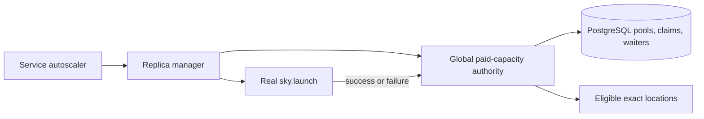
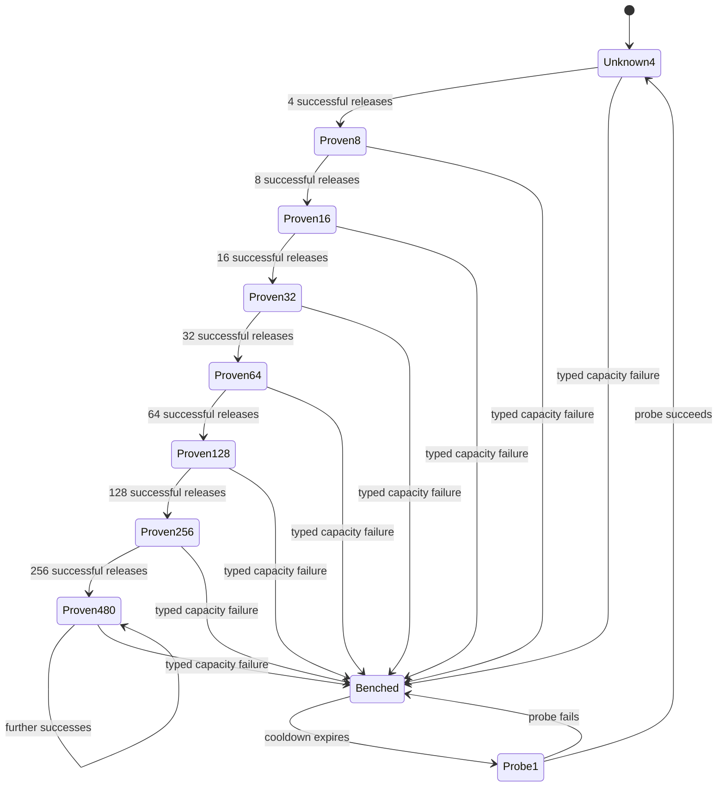

# SkyServe Global Paid-Capacity Authority

_Created: 2026-07-22_
_Expanded: 2026-07-23_
_Last updated: 2026-07-24_

## Status

The PostgreSQL global paid-capacity authority shipped with database migration
027. PR #909 reduced its exact-pool bootstrap from 60 to four, added a sticky
failure cooldown and one-probe recovery, bounded controller submission by API
worker capacity, and corrected dashboard lifecycle semantics. It passed the
full PR suite, including the required real-PostgreSQL lane, and shipped as
image and chart 1.1.759 from merge
`1f0bc56953ecc7d7366f7f6858234ea751c2cf98`.

The first production cycle exposed a second-order amplification across exact
pools: after the inherited 72-claim legacy cohort drained, one service acquired
49 unresolved claims across 28 independent pools (four claims in seven new
pools and one probe in 21 previously failed pools). The exact-pool invariants
held, but their sum was still too large for one service. The follow-up
correction adds an atomic 16-claim per-service envelope across pools. PR #915
passed the full suite, including the real-PostgreSQL lane, and merged as
`c249e39368edfa98d7de240716ce88721d1da909`. The exact correction image and
chart were published as 1.1.768. Production is on the subsequent 1.1.769
release, which contains that merge, at Helm revision 254. The live controller
adopted an inherited 27-claim overage, reported `service_limit=16` and
`service_remaining=0`, and created no post-deployment claim while over limit.
After normal outcomes reduced the inherited cohort to five, it exposed 11
slots, acquired exactly 11 fresh claims, and stopped at 16 total.

## Problem

SkyServe can persist a large missing-capacity wave before any provider launch
returns. Dynamic fallback placement deliberately selects the cheapest active
location until provider feedback benches it. Without a bound, hundreds of
PENDING replicas can be pinned to one unverified Spot zone. With a small fixed
per-service bound, large waves spill across many regions before feedback even
when the cheapest provider pool is deep.

The original paid placement cohort bounded each exact `Location` at four
unresolved launches. A later global authority changed the cold cohort to 60 so
a target of hundreds would not traverse the configured AWS and GCP region set
too quickly. Increasing a per-service constant alone left two structural gaps:

1. Multiple services can each spend the full allowance against the same pool.
2. Recent real successes do not increase the depth assigned to a proven pool.

The policy, parsing, accounting, and selection glue currently live inside
`replica_managers.py`, mixing cross-service capacity authority with per-service
replica lifecycle management.

Production evidence showed two additional gaps in the global implementation:

1. A cold exact pool may submit all 60 claims before the first provider result.
   In one observed pool, 24 requests succeeded and 43 then failed after the
   pool exhausted. The failure reset the next cohort but could not retract the
   already submitted siblings.
2. Failure timestamps survive in PostgreSQL, but placement admission ignores
   them. Controller or API-server restart reconstructs a fresh process-local
   placer and retries exact pools that failed minutes earlier.
3. Per-exact-pool limits compose additively. A large placement catalog can
   submit a small cohort or probe in many pools at once; production observed
   49 unresolved paid claims for one service even after every individual pool
   obeyed the corrected four-or-one bound.

SkyServe also has two independent concurrency layers. A replica becomes
PROVISIONING when its local launch thread submits a long API request, while
the API server may still be waiting for a long worker. In the observed
deployment, SkyServe admitted up to roughly 330 launch threads while the API
server had 128 long workers. The dashboard then described durable intent,
API-queued work, provider provisioning, and retained failure history as
machines or provisioning capacity. At the incident peak the history showed
more than 1,300 provisioning replicas, while the provider-facing cohort was
bounded independently and many rows were still queued intent.

## Goals

Fresh paid demand placement keeps cheapest-first economics while limiting the
combined unresolved work sent by all service controllers to one exact provider
pool. Unknown pools start at four claims. Genuine successful launches expand
the shared limit through 8, 16, 32, 64, 128, 256, and 480. A typed provider
capacity failure immediately closes the pool to new claims for ten minutes.
After the cooldown, one shared probe is allowed; its success reopens the
four-wide cohort and its failure restarts the cooldown. Stale positive evidence
also returns the pool to the four-wide cohort.

The exact-pool bound remains deliberately per instance type rather than per
zone, but it is nested inside a second atomic per-service envelope. A service
may hold at most 16 unresolved paid claims across every exact pool and
accelerator shape. This preserves parallel discovery across independent pools
without allowing a large catalog to multiply one service's provider-facing
work without bound. Successful launches release claims immediately, so the
envelope limits unresolved latency rather than total fleet size or steady-state
throughput.

In consolidation mode, the default global Serve submission bound must not
exceed the API server's guaranteed long-worker parallelism. This prevents a
large hidden API queue while retaining concurrency across independent pools.
An explicit `SKYPILOT_SERVE_OVERRIDE_CONCURRENT_LAUNCHES` remains an operator
escape hatch.

The shared authority must be atomic across HA controllers, survive process
restart, preserve request priority for new claims, remain non-preemptive, and
upgrade cleanly while old controllers and unresolved pre-migration replica rows
still exist. This authority is a central-server PostgreSQL feature. A local
SQLite controller keeps the existing per-service launch window and never
enters the shared claim protocol.

Paid-capacity policy and persistence integration live in a focused central
module. `replica_managers.py` consumes its interface without owning the policy.

## Non-Goals

The authority does not launch disposable probe machines, reserve provider
capacity, predict future provider inventory, migrate READY replicas between
regions, change accelerator compatibility allocation, or replace the spot
placer's cost ordering and bench semantics.

It also does not serialize the whole fleet, add arbitrary sleeps between
healthy independent launches, cancel requests that may already be mutating a
provider, or treat a broad region as unavailable because one exact instance
type failed.

## Background

An unresolved paid launch is a nonterminal replica at an active non-zero-cost
location with status PENDING or PROVISIONING. STARTING, READY, and NOT_READY
replicas prove provider capacity was acquired and do not consume admission.

The manager currently reconstructs a wave-local budget from one service's
replica rows. Selection filters locations with remaining allowance, then
delegates to `DynamicFallbackSpotPlacer`, which chooses the cheapest active
candidate. The budget is debited after a replica row is persisted. This is safe
within one manager lock but not across services or controller processes.

SkyServe already stores HA-fenced service state and reserved-capacity
arbitration in the central Serve PostgreSQL database. Provider launch outcomes
are observed in `_refresh_thread_pool()`, where the local placer is activated
or benched before completed replica rows are persisted.



## Behavior Contract

### Scope

The global paid authority applies to fresh demand launches and fresh
cost-rebalance replacements at non-zero-cost locations. It does not constrain:

- zero-cost reserved-capacity demand or fill;
- recovery re-drives with an immutable persisted location;
- services without a spot placer.

A recovery-pinned unresolved paid row, including a cost-rebalance replacement,
still counts against global capacity. It does not acquire a second claim. See
`serve-restart-safe-cost-rebalance.md` for the replacement protocol.

Fresh claim acquisition is blocked once a service enters a launch-blocking
status. Adoption and launch-outcome persistence remain allowed for the same
fenced service incarnation during shutdown and failed cleanup so the controller
can release claims, persist final rows, and finish teardown. A refresh tick
with no completed launches performs no paid-capacity database write.

### Exact pool identity

`PaidCapacityPoolKey` is a deterministic, versioned value containing:

- credential workspace;
- cloud;
- region;
- zone;
- exact instance type when catalog resolution provides one;
- accelerator model and count;
- Spot mode; and
- node count.

The key deliberately excludes image, disk tier, application configuration, and
service identity because those do not identify provider capacity. Provider
account IDs may be attached to outcome observations later, but must not appear
in user-visible logs or replica rows.

`spot_placer.Location` retains the resolved instance type so two catalog shapes
that consume different provider pools cannot share claims accidentally.
Instance type participates in location equality and hashing. A legacy location
without an instance type maps to a current location only when every other
shape field matches and exactly one current instance type is possible.
Ambiguous legacy locations are skipped rather than guessed.

Catalog-resolved instance types remain independent placement candidates.
Selection therefore may try a second exact type in the same zone before a
costlier region, when its normal per-GPU cost ordering says so. The launch is
pinned to the selected type because an unpinned provider fallback could consume
a different pool than the claim. A capacity failure benches only that exact
type/location candidate, leaving other types in the same zone eligible. This is
an intentional extension of provider-pool depth, not accidental duplicate
enumeration.

During a mixed-version rollout, legacy rows without `instance_type` remain
strictly unresolvable for shared-claim attribution when several current types
match. Operational placement behavior uses a separate temporary compatibility
fallback: local bench, activation, cost, and queued-launch admission resolve
such a row to the cheapest otherwise-equivalent current type. This preserves
pre-upgrade progress without guessing a global claim identity.

### Central claims

The central database contains one pool row per exact key and one claim row per
service incarnation and replica ID. The service row serializes the per-service
envelope; the pool row serializes the exact-pool limit.

Claim acquisition locks and validates the service owner before locking the
pool row. It reconciles orphan claims for both scopes, rejects a new identity
when the current service already holds 16 valid unresolved claims, expires
stale positive evidence, applies priority admission, and compares the pool's
active claim count with its current limit. `ACQUIRED` atomically persists both
the replica and its claim. Every denied result writes no replica and starts no
launch thread. The consistent service-then-pool lock order serializes
concurrent claims into different pools without introducing a cross-service
deadlock.

Claims remain active while the matching durable replica is PENDING or
PROVISIONING. Success, failure, terminal transition, deletion, service
replacement, and purge release them. Reconciliation removes an orphan even if
a controller died between lifecycle steps.

A selection snapshot is advisory. Another controller can consume the final
slot between snapshot and persistence. The atomic claim result is
authoritative; a stale snapshot causes clean no-progress and retry, never
oversubscription.

### Adaptive depth

The default bootstrap limit is four. Operators may override it with the
positive-integer environment variable
`SKYPILOT_SERVE_PAID_LOCATION_LAUNCH_WINDOW`. Invalid or non-positive values
log a warning once per distinct value and fall back to four.

The per-service envelope defaults to 16 and is independently configurable with
`SKYPILOT_SERVE_PAID_SERVICE_LAUNCH_WINDOW`. Invalid or non-positive values
fall back to 16. It applies only to the PostgreSQL shared-authority path; local
SQLite preserves its existing compatibility behavior. An upgraded controller
adopts but does not cancel excess claims created by an older binary. Their
overage blocks new claims for that service until normal launch outcomes drain
the count to the envelope.

Every successful genuine provider launch releases its claim and increments the
pool's success count. When the count reaches the current limit, the authority
doubles the limit and resets the count:



The default maximum is 480 and is internally configurable with
`SKYPILOT_SERVE_PAID_LOCATION_MAX_LAUNCH_WINDOW`. Its effective value is never
below the bootstrap limit. Positive evidence expires after ten minutes without
a success. Operators may override this TTL with
`SKYPILOT_SERVE_PAID_LOCATION_SUCCESS_TTL_SECONDS`. Advisory snapshots evaluate
expiry without mutating state. Claim acquisition evaluates and persists expiry
while holding the pool lock.

A typed provider-capacity launch failure resets the learned limit and success
count to the bootstrap value and sets durable negative evidence. A non-null
`last_failure_at` is an uncleared negative epoch; a later
`last_success_at` alone does not reopen it. This sticky interpretation is
required for mixed-version safety because a revision-027 controller can admit
and record successes during the cooldown, but it never clears
`last_failure_at`.

While the negative epoch is active, the admission limit is zero until the
cooldown expires and one afterward. The cooldown defaults to ten minutes and
is configurable with the positive-integer
`SKYPILOT_SERVE_PAID_LOCATION_FAILURE_COOLDOWN_SECONDS`.

The one-probe bound is evaluated while holding the existing exact-pool row
lock, so it is global across services and controller processes. Existing
claims selected before the failure are not killed: some may already be inside
provider mutation, and unsafe cancellation can leak resources. They continue
to count against the probe limit until they resolve. This bounds a cold
failure's newly submitted siblings to the bootstrap cohort and prevents new
cohorts after evidence arrives.

When the first post-cooldown claim is acquired under the pool lock, the
authority persists `current_limit=1` as a probe marker. Only a success from a
claim selected after `last_failure_at + cooldown`, observed while that marker
still holds, may clear `last_failure_at`, restore the bootstrap limit, and
record new positive evidence. An old binary never clears the negative epoch.
If it overwrites the marker during a mixed rollout, the result is
conservative: the success cannot reopen the pool and a later new-code probe is
required.

Unknown, application, configuration, control-plane, and ownership failures
release their claims without changing shared provider-capacity evidence. The
manager may retain its existing conservative local bench and queued-sibling
invalidation behavior for an unknown failure, but that local fallback is not
evidence strong enough to poison a pool shared by other services. Outcome
processing compares each claim's selection timestamp with the pool's latest
failure timestamp and cooldown boundary, so a slower success selected before a
newer failure cannot undo that failure or reopen global admission.

Correctness timestamps come from PostgreSQL `clock_timestamp()` sampled after
the transaction acquires the exact-pool row lock, not from a controller's
`time.time()` and not from transaction-stable `CURRENT_TIMESTAMP`. A
transaction may begin before a failure, wait on its row lock, and enter the
critical section after it; only the post-lock wall clock preserves that
ordering. Claim timestamps are immutable after insertion. Mixed-version
adoption cannot prove when an old launch crossed selection, so adopted claims
use the conservative pre-evidence timestamp zero. They count against headroom
and may produce negative evidence, but their success cannot clear a negative
epoch.

The new four-based ladder is normalized lazily under the same pool lock.
Persisted limits that are not a rung of the configured ladder
`base, base*2, ... ceiling` reset to the bootstrap limit with zero accumulated
successes. With the default configuration this converts revision-027's
60/120/240 rungs to four while retaining a fresh, deeply proven 480 ceiling.
An explicit operator bootstrap such as 60 generates and preserves its own
60/120/240/480 ladder. Advisory reads apply the same conservative
normalization before showing headroom; atomic acquisition persists it. The
intentional `current_limit=1` probe marker is exempt while
`last_failure_at IS NOT NULL`: advisory state derives its zero-or-one effective
admission directly from the negative epoch and never normalizes the marker
away.

The implementation reuses revision 027's `last_failure_at`,
`last_success_at`, current limit, and claims. The sticky negative epoch and
one-probe marker refine previously advisory field semantics but need no new
column or migration.

### Submission concurrency

`PENDING` and `PROVISIONING` claims remain part of paid-pool accounting, but
the 16-claim service envelope is independent from the process submission
ceiling. In consolidation mode the latter is:

```text
min(
  service-memory-derived launch bound,
  API-server guaranteed long-worker parallelism,
)
```

The API startup calculation is authoritative. After computing
`ServerConfig`, the supervisor publishes the actual
`long_worker_config.garanteed_parallelism` into the clean immutable environment
captured for consolidated controller children. Controllers do not recompute it
from potentially different process environments, reserved-memory inputs, or
resource views. A missing published value during mixed-version rollout
preserves the old bound until that controller is replaced.

The cap recognizes consolidation from the controller-process override and the
external-load-balancer Helm capability signal as well as the server config.
The per-service config snapshot intentionally omits the server's
`serve.controller.consolidation_mode` setting, so reading that snapshot alone
would silently leave production controllers uncapped.

The service envelope is authoritative at durable claim persistence, while the
worker ceiling includes zero-cost and lifecycle operations that do not consume
paid claims. Neither is proof that every submitted request is provider-active:
unrelated long operations can occupy workers. The explicit Serve launch
override remains authoritative for process concurrency, but it does not bypass
the paid service envelope.

Non-consolidated controllers keep their existing local worker accounting.

### Operator-facing lifecycle

Existing public replica status values remain backward compatible. The
dashboard derives more truthful stages from status plus the already exposed
`launched_at` provider boundary:

- queued intent: PENDING, or PROVISIONING without `launched_at`;
- provider/setup in progress: PROVISIONING with `launched_at`;
- initializing/not ready: STARTING or NOT_READY;
- serving: READY;
- stopping: SHUTTING_DOWN or PREEMPTED;
- cleanup uncertain: FAILED_CLEANUP; and
- historical failure: other failed terminal states.

The regional view is labeled as tracked replica attempts, not machines. It
reports current-or-cleanup-uncertain and all-tracked totals separately.
Exact-card committed/unready capacity is redefined to include only PENDING,
PROVISIONING, STARTING, and NOT_READY rows. SHUTTING_DOWN and PREEMPTED are
stopping capacity, not future serving capacity; failed and cleanup-uncertain
history is also excluded. Exact-card labels use “committed/unready capacity”
rather than claiming every non-ready row is a provisioning machine.

The persisted exact-card `accelerator_breakdown` JSON adds a
`capacity_semantics_version` field without changing its existing LB
compatibility `version`. New samples use semantics version 2. Legacy samples
without that field counted stopping rows in `provisioning_capacity`; the
dashboard omits those old points from the committed/unready series and
explains the gap rather than relabeling them incorrectly. The aggregate
replica-history series is narrower and unchanged: it combines PENDING,
PROVISIONING, and STARTING while NOT_READY remains separate, so it is labeled
“committed/starting,” not “committed/unready.”

The selected service's summary, full replica snapshot, and history refresh
periodically with stale-response fencing; the page no longer freezes current
state after mount.

Shared-admission observability is deliberately aggregate and rate limited. A
controller logs pool-state counts, total active claims, effective admission,
remaining headroom, saturation, and legacy overage on a policy-state
transition, but never more than once per 30 seconds; an unchanged state is
reported at most once per five minutes. Pool keys and workspace identity are
not logged. A completed launch refresh emits one warning for the whole typed
provider-capacity failure wave, including only the failure and exact-pool
counts. Individual tracebacks remain in the bounded per-replica logs instead
of being repeated once per failure in the controller log.

### Priority

The autoscaler attaches the highest active request priority to each physical
scale-up wave. An instance-aware QPS wave is split into consecutive exact-card
batches and derives each batch's priority from request profiles compatible with
that card. An exact-card logical target carries the complete per-card map,
including explicit minimum-priority entries. Thus an A100-only priority-50
request does not promote an unrelated L4-only priority-20 launch. A request
with missing compatibility applies to every configured accelerator. Missing
or legacy priority evidence uses the minimum priority.

Priority is an admission hint, not a scale target. It is accepted only from a
complete fresh LB report and expires on the autoscaler's normal report
staleness threshold. Queue and compatibility gauges may remain conservatively
latched for capacity sizing, but stale evidence falls back to minimum priority
and cannot refresh a high-priority waiter indefinitely. If at least one valid
compatibility profile exists, aggregate queue priority is never used to promote
a card excluded by every profile.

Each saturated claim attempt publishes a short-lived waiter for its service
incarnation and pool. A lower-priority new claim defers while a fresh
higher-priority waiter exists. Equal-priority waiters are ordered by first
wait time. Existing claims, provisioning instances, and running replicas are
never revoked. Priority therefore controls only the next available claim.

Successful claims remove their service's waiter immediately. Continued
saturated or deferred attempts refresh their heartbeat; an abandoned attempt
stops refreshing and expires after the 45-second heartbeat TTL, configurable
with
`SKYPILOT_SERVE_PAID_LOCATION_WAITER_TTL_SECONDS`. This prevents stale high
priority demand from starving peers without requiring durable scale-up wave
identifiers.
A saturated pool may spill the wave to the next compatible paid pool. A
lower-priority claim deferred by an already-waiting higher-priority service
does not exhaust that pool or spill to a more expensive pool; it waits for a
later tick while preserving cheapest-first economics. The wave marks that
exact pool as priority-deferred. Later replicas in the same wave stop before
another database claim against the same cheapest pool. They do not filter the
pool out of paid candidates, which would incorrectly spill them to a more
expensive pool. Zero-cost capacity and independent exact pools remain eligible.

Saturation is evaluated before waiter ordering. A full pool always returns
`SATURATED`, allowing normal spill while retaining the published waiter for a
future slot. `HIGHER_PRIORITY_WAITING` is returned only when real headroom
exists but belongs to a better waiter. A physical wave stops immediately after
that result so it neither repeats the database claim nor consumes a benched
location's one TTL retry probe. Logical exact-card reconciliation independently
continues other card targets.

### Upgrade and restart

There are two distinct mixed-version transitions.

Migration 027 creates empty additive pool, claim, and waiter tables. During a
026-to-027 rollout, each new controller transactionally adopts unresolved
paid rows belonging to its own service when their exact pool is attributable.
An old unkeyed row cannot safely be assigned to every exact pool, so it is not
globally debited from unrelated pools. Old controllers can still create
unclaimed rows and cannot participate in the new atomic claim protocol. The
hard cross-service bound therefore applies only after every active service
controller runs the new version and attributable rows have been adopted, or
ambiguous old rows have completed. This is a bounded rolling-upgrade condition,
not a steady-state relaxation.

The correction rollout starts from shipped revision-027 controllers. Those
controllers already create claims with the legacy 60-wide default, ignore the
cooldown, and may clamp a new controller's probe marker back to their
bootstrap. Sticky `last_failure_at` prevents their successes from clearing a
negative epoch, but their unresolved claims remain valid after controller exit
and recovery adoption. New controllers never revoke those claims and admit no
new work while their count exceeds the new effective limit. The four-wide
invariant is active only after all revision-027 controllers have exited, every
exact pool's valid active claims have drained to its new effective limit, and
the earlier 026-to-027 unattributable-row gate is clear.

Revision 010 historically imported the live replica-row projection for its
pickle-to-JSON backfill. Revision 027 adds a current-schema field to that live
projection, which would make an upgrade replay of 009 to 010 attempt to write a
column that did not exist at revision 010. This implementation intentionally
corrects revision 010 in place by freezing the eight-field projection owned by
that migration, matching the already-frozen convergence projection in revision
026. No deployed revision identifier or stored data meaning changes.

For common catalog-expanded shapes, several instance types can match one old
row, so exact adoption may be unavailable throughout that row's remaining
lifetime. Those rows remain outside the hard global bound until completion.
Operational fallback keeps their queued launches and placement evidence moving
through the cheapest compatible current type. Rollout observability must report
the count of unattributable unresolved legacy rows before declaring the global
bound fully active.

Controller restart reconstructs wave snapshots from shared claims and durable
replica rows. It neither resets proven capacity nor acquires duplicate claims
for recovery-pinned replicas. Service recreation invalidates claims and waiters
from the previous service hash.

A schema/code rollback from revision 027 to 026 leaves the additive tables
unused. A later upgrade reconciles their rows against current service
incarnation and replica status. A correction-image rollback to shipped
revision-027 code is different: it continues using the tables with the old
60-wide, non-cooldown behavior described in Rollout and Rollback below.

Pool rows are small retained history keyed by configured exact provider pools.
Claims and waiters are reconciled or expired. Version one does not delete empty
pool rows because retaining ramp and failure evidence across an idle interval
is part of the policy, and the key set is bounded by catalog-expanded service
configuration rather than request volume.

The bootstrap default changes the historical scope of
`SKYPILOT_SERVE_PAID_LOCATION_LAUNCH_WINDOW`. On PostgreSQL it is the global
exact-pool bootstrap and now defaults to 4. On local SQLite it remains the
legacy per-service window, whose unset default is also 4. An explicit value
continues to configure both paths for backward compatibility. Operators that
previously set this variable retain their configured value and should review
the global cross-service scope before rollout.
Because local SQLite has no global claim identity, an ambiguous pre-instance-
type row conservatively debits the cheapest compatible exact type selected by
the operational rollout resolver.

## Central Module

`sky/serve/paid_capacity.py` owns:

- configuration parsing;
- exact pool-key construction;
- pure ramp, reset, and expiry policy;
- conversion of central state into location availability;
- atomic claim integration with Serve persistence; and
- outcome batching and redacted observability.

The internal orchestration interface is:

```python
build_launch_budget(
    placer,
    workspace,
    existing_replica_infos,
    globally_managed,
) -> LaunchBudget

select_location(
    placer,
    budget,
    skip_zero_cost_preference,
    allowed_locations,
) -> Location | None

try_persist_claim(
    service_name,
    service_hash,
    replica_id,
    replica_info,
    location,
    budget,
    priority,
    controller_owner,
) -> ClaimResult

defer_for_priority(
    budget,
    location,
) -> None

debit(
    budget,
    location,
) -> None

exhaust(
    budget,
    location,
) -> None

adopt_existing_claims(
    service_name,
    service_hash,
    controller_owner,
    workspace,
    placer,
    replica_infos,
    priority,
) -> bool

persist_completed_launches(
    service_name,
    service_hash,
    replica_infos,
    outcomes,
    controller_owner,
) -> bool | None
```

`ClaimResult` is one of `ACQUIRED`, `SATURATED`, `SERVICE_SATURATED`,
`HIGHER_PRIORITY_WAITING`, `OWNERSHIP_LOST`, or `LEGACY_LOCAL`.

`serve_state.py` owns the PostgreSQL transaction, storage primitives, and
waiter ordering performed inside the admission transaction. It calls the
central module's pure `effective_limit()` and `record_outcomes()` policy
functions while holding the exact pool lock. Logs expose counts and limits,
not raw pool keys containing workspace identity.

`replica_managers.py` retains only orchestration:

1. ask the central module for apparent eligible locations;
2. let the existing spot placer select the cheapest candidate;
3. request an atomic claimed persist;
4. enqueue a launch only on `ACQUIRED`; and
5. report launch outcomes in one deterministic batch.

## Alternatives Considered

A process-local cache cannot coordinate HA replicas or survive restart.

Counting only the current service's rows retains cross-service double-spend.

The generic KV cache cannot atomically commit a capacity claim with a replica
row or reconcile it relationally against service incarnation and status.

Dedicated probe machines create cost and capacity unrelated to real demand.
Genuine demand launches provide the required feedback.

Least-loaded placement would spread even when a cheap pool has proven depth
and would conflate economics with capacity admission.

Serializing every launch, or adding random sleep to every worker, would reduce
useful concurrency across independent exact pools and regions. The 16-claim
service envelope preserves bounded breadth while the smaller exact-pool cohort
bounds correlated failures.

A region-wide negative cache would incorrectly poison healthy instance types,
zones, accelerator shapes, or purchase modes because one exact pool failed.
The durable key stays exact and is shared across services instead.

Canceling API-queued siblings after the first failure has an unavoidable race
with provider mutation. The small cohort plus durable close bounds the waste
without killing work whose mutation boundary is uncertain.

Deriving the durable claim limit from the global launch-thread budget couples
one service's provider behavior to unrelated controller memory sizing. The
paid authority owns fixed, observable service and provider-pool envelopes.
Conversely, leaving the Serve-wide process bound above the API execution pool
creates a hidden queue. The design therefore caps total submissions at worker
capacity without deriving either durable claim envelope from it.

## Changed-Path-to-Test Matrix

| Changed invariant | Test proof |
| --- | --- |
| Default and invalid fallback are 4; maximum is at least bootstrap | Pure configuration tests |
| Failure cooldown defaults to ten minutes and rejects invalid overrides | Pure configuration tests |
| Exact keys distinguish workspace, cloud, region, zone, instance type, accelerator shape, Spot mode, and node count | Pool-key equality tests |
| Combined claims across services never exceed the pool limit | Concurrent PostgreSQL admission test |
| One service never holds more than 16 valid unresolved paid claims across distinct pools; stale claims do not consume the envelope; legacy overage blocks without revocation | Concurrent PostgreSQL cross-pool admission and reconciliation tests |
| Claim and replica persist atomically under service-owner fencing | Persistence and ownership-loss tests |
| PENDING and PROVISIONING count; provider success, terminal rows, service replacement, and missing replicas do not | Reconciliation tests |
| 4, 8, 16, 32, 64, 128, 256, 480 ramp; stale success resets to 4 | Pure policy and state-transition tests |
| Legacy 60/120/240 rows normalize to 4 while an explicit 60 bootstrap retains its configured ladder | Pure policy and locked PostgreSQL normalization tests |
| A typed failure creates a sticky negative epoch, permits one marked global probe after cooldown, and only that probe's success clears failure and reopens four slots | Pure policy and PostgreSQL concurrency tests |
| Claim and outcome ordering use post-lock PostgreSQL `clock_timestamp()`; claimed_at is immutable; adopted claims use zero and cannot clear negative evidence | PostgreSQL ordering, adoption, clock-skew, and lock-wait regression tests |
| A saturated pool spills regardless of waiter order; with real headroom the higher-priority waiter gets the next claim; no existing claim is revoked; one deferred physical wave performs one central claim and selection attempt without paid spill | PostgreSQL priority arbitration and large-wave replica-manager tests |
| Exact-card logical demand derives priority independently per accelerator | Autoscaler and replica-manager tests |
| Instance-aware QPS batches preserve card-specific priority; valid profiles never promote excluded cards; stale evidence falls back to minimum | Autoscaler and controller actuation tests |
| Restart adoption and recovery preserve the claim in both relational and serialized replica state without duplicating it | Recovery test |
| Cheapest selection spills on claim 5 at bootstrap, but the physical wave stops when the service envelope is exhausted | Replica-manager integration test |
| A stale selection snapshot loses cleanly at the atomic persist | Cross-controller race test |
| Owning controllers adopt attributable legacy rows; an unrelated unkeyed row does not debit every pool | Mixed-version compatibility test |
| Local SQLite retains the unset legacy per-service window of 4 and stays below its 999-bind batch limit | Non-PostgreSQL fallback and constrained SQLite batch tests |
| Empty refresh ticks do not write; teardown can persist completed outcomes | Replica-manager and ownership tests |
| Tuple-backed compatibility reports preserve per-card launch priority | QPS and concurrency autoscaler ingestion tests |
| Exact instance types remain distinct; strict claim resolution rejects ambiguous legacy rows while operational rollout resolution uses the cheapest matching current type | Spot-placer compatibility tests |
| Only a typed capacity failure resets shared evidence; generic failures can retain local bench behavior while reporting `OTHER_FAILURE` globally | Launch-thread and replica-manager outcome tests |
| Capacity failure wins a same-batch update and late pre-failure success cannot rebuild the ramp | Ordered outcome tests |
| Admission summaries are transition/interval bounded, contain useful aggregate counts, and never expose workspace-bearing pool keys; provider-capacity tracebacks collapse to one wave warning | Pure logging-policy and replica-manager tests |
| API startup publishes its actual guaranteed long-worker count; controller-process and external-LB runtime signals activate the cap even when the per-service config omits consolidation; default consolidated Serve admission does not exceed it; explicit override remains authoritative | CPU-bound, memory/reservation-bound, and production-topology server/controller tests |
| Dashboard distinguishes queued intent, provider/setup, cleanup uncertainty, and history; periodic refresh updates current rows | Dashboard lifecycle and timer tests |
| Exact-card committed/unready membership is PENDING, PROVISIONING, STARTING, and NOT_READY only | Controller aggregate membership test across every replica status |
| New exact-card history samples carry capacity semantics v2; legacy samples are omitted from the committed/unready series without changing LB compatibility version | Mixed old/new history serialization and dashboard tests |
| Legacy revision-027 over-limit claims block new admission until they drain; old-code marker overwrite/success leaves failure sticky and requires a fresh probe | Mixed-binary PostgreSQL state-transition test |
| Migration 009 through 027 uses a frozen revision-010 projection; 026 to 027 is additive; downgrade to 026 removes only the new schema | Upgrade and downgrade migration tests |
| A rollback binary targeting 026 accepts an already-upgraded 027 schema | Migration ownership test |

## Manual Test Plan

Run two staging services against the same exact paid pool. Generate enough
demand for both to exceed four unresolved launches. Confirm the combined claim
count never exceeds four, a higher-priority waiter receives the next released
claim, a fully saturated pool still spills to the next paid candidate, and no
READY replica is preempted.

For a shape with several exact instance types in one zone, confirm each type
has an independent four-claim bootstrap and graph both exact-pool and aggregate
zone headroom. Generate enough demand to span at least five exact pools and
confirm the owning service never exceeds 16 unresolved paid claims in total.
Release one claim and confirm exactly one new cross-pool claim can enter.

Complete 4, 8, 16, 32, 64, 128, and 256 real launches and confirm the shared
limit reaches 8, 16, 32, 64, 128, 256, and 480 respectively. Inject one typed
capacity failure and confirm new claims stop immediately. Confirm no more than
the pre-existing four-wide cohort can still resolve, no new claim is accepted
for ten minutes, exactly one cross-service probe is accepted afterward, a
failed probe restarts the cooldown, and a successful probe reopens four slots.
Confirm a different exact type in the same region remains eligible.

In a consolidation deployment where the service-derived limit exceeds the API
long-worker pool, generate a large demand wave. Confirm the default number of
submitted Serve launch requests never exceeds the guaranteed long-worker
parallelism and that an explicit Serve override remains observable and
authoritative.

Restart the owning controller and rotate the API-server pod while claims are
active. Confirm claims remain attached to durable PENDING and PROVISIONING
replicas, the failure cooldown survives, and no duplicate replica rows or
launches appear. Confirm the dashboard labels rows without `launched_at` as
queued intent, rows with it as provider/setup in progress, and retained
terminal rows as history rather than current machines. Wait for one automatic
refresh and confirm all counts advance without a manual page reload.
Confirm the controller emits one aggregate warning for a provider-capacity
failure wave and bounded admission summaries without raw pool keys or
workspace identity.

During a rolling upgrade from migration 026 code, leave attributable unresolved
legacy rows in place and confirm each owning new controller adopts them before
re-driving recovery when their exact type is attributable. For ambiguous
no-type rows, confirm strict claim adoption skips them while queued-launch
admission and local placement evidence continue through the cheapest matching
current type. Confirm an unrelated unkeyed row does not stop admission to every
exact pool. Do not declare the hard global bound active until all old
controllers have exited, and the observed ambiguous-row count reaches zero.

During the correction rollout, begin with a revision-027 pool holding more
than four valid claims. Confirm a new controller adopts but does not revoke
them, accepts no new claim until the count drains to the effective limit, and
does not declare the new bound active merely because the old controller
exited. Have an old binary clamp a `current_limit=1` marker and record a later
success; confirm `last_failure_at` remains sticky and new code requires a fresh
post-drain probe.

Also begin with one service holding more than 16 claims spread across several
pools. Confirm the upgraded controller preserves and re-drives the inherited
work, admits no additional paid claim while the service is over its envelope,
and resumes one-for-one admission only after outcomes reduce the count below
16.

Render history containing both legacy accelerator-breakdown JSON and new
capacity-semantics-v2 samples. Confirm the exact-card committed/unready line
omits legacy points with explanatory copy while ready and other compatible
series remain visible.

## Rollout and Rollback

Revision 027 is already deployed. This correction reuses its rows and requires
no migration. Deploy the new API-server and service-controller code through
the normal HA rolling upgrade with existing Helm values reused. A new
controller immediately honors a recent persisted `last_failure_at`; this is
intentional and prevents rollout-triggered retry storms. Old controllers do
not honor the cooldown during the mixed window. Declare the correction active
only after every old controller exits, no exact pool has valid active claims
above its new effective limit, and no unattributable legacy row remains. Local
SQLite deployments continue using the legacy per-service window and do not
gain cross-service cooldown authority.

Monitor learned pool limit, effective admission limit, cooldown/probe state,
active claims, stale reconciliation, admission denials, priority deferrals,
success ramps, failure resets, placement spread, API request queue depth,
provider capacity errors, and launch latency.

Rollback is an image rollback. Existing pool, claim, waiter, success, and
failure rows remain schema-compatible with revision 027. A rollback binary
ignores the refined sticky meaning of `last_failure_at`, may clamp the
`current_limit=1` probe marker back to its bootstrap, and uses its prior
default cohort. It still never clears `last_failure_at`, so a later upgrade
returns conservatively to the negative epoch and requires a new-code probe.
No live replica is moved or terminated by either rollout or rollback.
Operators may temporarily restore a larger explicit launch window without
rolling back if the four-wide cold start is too conservative.

## Verification Evidence

Pre-PR implementation evidence on 2026-07-23, integrated onto
`0c8ef6be33889bba2adf53dd4073a42e552ba7c3`:

- All 934 affected unit tests passed sequentially before the final upstream
  merge. After integration, 933 deterministic tests passed; the remaining
  validator was isolated after its live EKS discovery call hung locally and is
  retained in the full CI gate.
- 36 real PostgreSQL authority and migration-chain tests passed, including a
  027 to 026 to 027 cycle.
- Changed production files passed pylint at 10.00/10.
- Mypy passed 744 source files.
- YAPF, isort, and `git diff --check` completed cleanly.
- The final exact-tree Opus pass returned `APPROVE` after confirming every
  earlier concurrency, priority, migration, rollout, and test finding was
  addressed. Its one follow-up YAPF alignment was fixed and re-approved. Opus
  also reviewed the final merge with the new incomplete-fill-shelter fallback
  and approved the combined compatibility-completeness semantics.

After deployment this section is updated with the merge SHA, published image
and chart version, Helm revision, migration state, API health, controller
readiness, and fleet health.

Corrective local evidence on 2026-07-24:

- 543 focused Python policy, controller, replica-manager, history, and server
  configuration tests passed serially. A 16-worker run exposed one
  shared-state ordering failure that passed in isolation; serial execution is
  the deterministic local evidence.
- All 56 affected dashboard tests passed.
- The 20 real-PostgreSQL paid-capacity authority cases were collected but
  skipped because this host has no Docker daemon. The added cooldown/probe,
  mixed-binary, and post-lock database-clock cases remain a required CI gate.
- Mypy passed 745 source files. Changed production files passed pylint at
  10.00/10. Dashboard ESLint passed with no warnings.
- YAPF, isort, Prettier, and `git diff --check` completed cleanly.
- Adversarial review against this repository revision corrected two
  production-topology gaps before validation: consolidation detection now
  accepts the controller-process and external-LB runtime signals, and
  autoscaler versus status-history lifecycle labels remain distinct.
- PR #909 passed every visible check, including the mandatory PostgreSQL unit
  lane, and merged as `1f0bc56953ecc7d7366f7f6858234ea751c2cf98`.
- Image and chart 1.1.759 passed registry readback and rolled out through Helm
  revisions 248 and 249. The API deployment became healthy and reported the
  exact merge commit. The previously recorded 314 was the Kubernetes
  Deployment generation, not a Helm revision.
- The inherited 72-claim cohort drained without new admissions and produced
  one aggregate `failures=72, exact_pools=3` warning. The next fresh cycle
  proved the exact-pool cooldown/probe policy but exposed 49 aggregate claims
  across 28 pools, motivating the service envelope above.

Follow-up correction evidence on 2026-07-24:

- 546 focused Python tests passed serially. A broad xdist run encountered one
  known shared-state ordering failure that passed immediately in isolation.
- The two added PostgreSQL cases cover a 12-thread distinct-pool race and
  legacy-overage reconciliation. They were collected but skipped locally
  because this host has no Docker daemon; PR #915's mandatory real-PostgreSQL
  lane passed.
- Mypy passed 746 source files. Changed production files passed pylint at
  10.00/10. YAPF, isort, dashboard ESLint/Prettier, and `git diff --check`
  passed.
- Every visible PR #915 check passed, including all optimizer, compatibility,
  limited-dependency, no-parallel, dashboard, static-analysis, and
  PostgreSQL-backed unit lanes. The PR merged as
  `c249e39368edfa98d7de240716ce88721d1da909`.
- Image and chart 1.1.768 passed exact-revision registry readback. The
  subsequent image and chart 1.1.769 at
  `7218e4453b3612e9423378b557da775e16785f05` contain the correction merge and
  deployed with existing Helm values reused. PostgreSQL migration job
  `skypilot-db-migration-254` completed, Helm revision 254 reached deployed,
  and Kubernetes Deployment revision 319 became 1/1 ready.
- The live API reports version 1.1.769 at the exact release commit and external
  `/api/health` returns healthy. The first service-controller attempt timed out
  while its external load balancer recovered from the Recreate handoff; the
  supervised retry became healthy, and both load-balancer slots resumed
  successful controller synchronization.
- Immediately before rollout, the service held 201 unresolved paid claims
  across 110 exact pools. At 08:47 UTC its newest claim was 08:46:39. After
  normal outcomes drained the inherited cohort to 27, the new controller
  reported `service_claims=27, service_limit=16, service_remaining=0` and
  `Stopping logical scale-up wave at the service paid-capacity envelope.`
  Repeated database samples through 09:12 UTC found zero post-deployment
  claims; the newest timestamp remained 08:46:39 despite scale-up requests
  with launch budgets of 83 and 412.
- At 09:14 UTC a bounded provider-capacity wave reported
  `failures=5, exact_pools=5`. The next admission summary observed five
  remaining claims and `service_remaining=11`; the controller acquired exactly
  11 fresh claims. Four subsequent database samples found 16 total claims and
  no newer claim timestamp, proving the first below-limit production cycle
  stopped at the service envelope.
- The admission summary remained one bounded aggregate without pool keys, and
  provider-capacity errors remained aggregated in the controller log. The
  09:11 UTC history bucket carried `capacity_semantics_version=2` and reported
  target 497, ready capacity 384, and provisioning capacity 27.

## Release Gate Results

- Complete: implement and validate the 16-claim service envelope, including a
  real-PostgreSQL distinct-pool race.
- Complete: pass the full visible PR CI on the follow-up integrated head.
- Complete: publish and deploy the follow-up with reused Helm values.
- Complete: verify that an upgraded live controller adopts an inherited
  service overage, admits no fresh claim while over limit, stops large
  scale-up waves at the envelope, retains bounded aggregate logs, and
  publishes semantics-v2 history.
- Complete: observe the inherited production cohort fall below 16 and verify
  the controller fills only the remaining 11 slots, leaving the first fresh
  cycle at exactly 16 claims.
