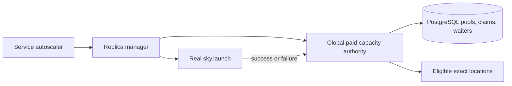
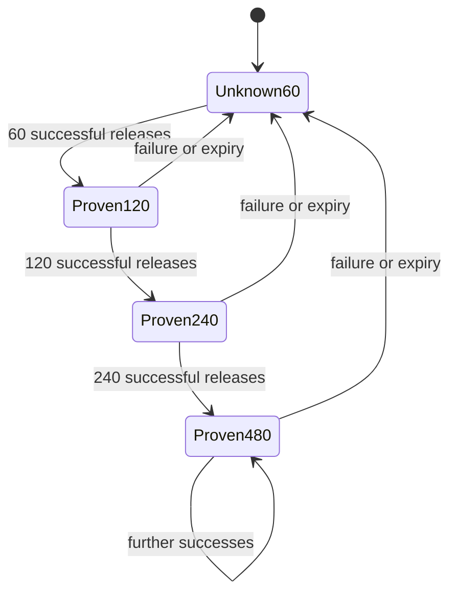

# SkyServe Global Paid-Capacity Authority

_Created: 2026-07-22_
_Expanded: 2026-07-23_

## Status

Implementation is in progress on `fix/serve-paid-window-20`. The release gate
is an exact-diff Opus review followed by the affected unit, real PostgreSQL,
format, lint, type, and migration suites. Merge and production rollout remain
blocked until those checks pass.

## Problem

SkyServe can persist a large missing-capacity wave before any provider launch
returns. Dynamic fallback placement deliberately selects the cheapest active
location until provider feedback benches it. Without a bound, hundreds of
PENDING replicas can be pinned to one unverified Spot zone. With a small fixed
per-service bound, large waves spill across many regions before feedback even
when the cheapest provider pool is deep.

The original paid placement cohort bounded each exact `Location` at four
unresolved launches. Production showed that four was too shallow: a target of
hundreds traversed much of the configured AWS and GCP region set. Increasing a
per-service constant alone also leaves two structural gaps:

1. Multiple services can each spend the full allowance against the same pool.
2. Recent real successes do not increase the depth assigned to a proven pool.

The policy, parsing, accounting, and selection glue currently live inside
`replica_managers.py`, mixing cross-service capacity authority with per-service
replica lifecycle management.

## Goals

Fresh paid demand placement keeps cheapest-first economics while limiting the
combined unresolved work sent by all service controllers to one exact provider
pool. Unknown pools start at 60 claims. Genuine successful launches expand the
shared limit through 120, 240, and 480. Capacity failures and stale positive
evidence reset the limit to 60.

The bound is deliberately per exact instance-type pool, not per zone. If a
zone offers seven distinct L4 instance types, its initial aggregate headroom
can therefore reach 420 while each provider pool remains capped at 60. This
lets large fleets probe multiple independent pools in the same region before
moving to a costlier region. Placement spread and unresolved claims per zone
must be monitored separately from the exact-pool safety invariant.

The shared authority must be atomic across HA controllers, survive process
restart, preserve request priority for new claims, remain non-preemptive, and
upgrade cleanly while old controllers and unresolved pre-migration replica rows
still exist. This authority is a central-server PostgreSQL feature. A local
SQLite controller keeps the existing per-service launch window and never
enters the shared claim protocol.

Paid-capacity policy and persistence integration live in a focused central
module. `replica_managers.py` consumes its interface without owning the policy.

## Non-Goals

The authority does not launch disposable probe machines, reserve provider
capacity, predict future provider inventory, migrate READY replicas between
regions, change accelerator compatibility allocation, or replace the spot
placer's cost ordering and bench semantics.

## Background

An unresolved paid launch is a nonterminal replica at an active non-zero-cost
location with status PENDING or PROVISIONING. STARTING, READY, and NOT_READY
replicas prove provider capacity was acquired and do not consume admission.

The manager currently reconstructs a wave-local budget from one service's
replica rows. Selection filters locations with remaining allowance, then
delegates to `DynamicFallbackSpotPlacer`, which chooses the cheapest active
candidate. The budget is debited after a replica row is persisted. This is safe
within one manager lock but not across services or controller processes.

SkyServe already stores HA-fenced service state and reserved-capacity
arbitration in the central Serve PostgreSQL database. Provider launch outcomes
are observed in `_refresh_thread_pool()`, where the local placer is activated
or benched before completed replica rows are persisted.



## Behavior Contract

### Scope

The global paid authority applies only to fresh demand launches selected by a
spot placer at non-zero-cost locations. It does not constrain:

- zero-cost reserved-capacity demand or fill;
- recovery re-drives with an immutable persisted location;
- cost-rebalance replacements with an already selected location; or
- services without a spot placer.

A recovery-pinned unresolved paid row still counts against global capacity. It
does not acquire a second claim.

Fresh claim acquisition is blocked once a service enters a launch-blocking
status. Adoption and launch-outcome persistence remain allowed for the same
fenced service incarnation during shutdown and failed cleanup so the controller
can release claims, persist final rows, and finish teardown. A refresh tick
with no completed launches performs no paid-capacity database write.

### Exact pool identity

`PaidCapacityPoolKey` is a deterministic, versioned value containing:

- credential workspace;
- cloud;
- region;
- zone;
- exact instance type when catalog resolution provides one;
- accelerator model and count;
- Spot mode; and
- node count.

The key deliberately excludes image, disk tier, application configuration, and
service identity because those do not identify provider capacity. Provider
account IDs may be attached to outcome observations later, but must not appear
in user-visible logs or replica rows.

`spot_placer.Location` retains the resolved instance type so two catalog shapes
that consume different provider pools cannot share claims accidentally.
Instance type participates in location equality and hashing. A legacy location
without an instance type maps to a current location only when every other
shape field matches and exactly one current instance type is possible.
Ambiguous legacy locations are skipped rather than guessed.

Catalog-resolved instance types remain independent placement candidates.
Selection therefore may try a second exact type in the same zone before a
costlier region, when its normal per-GPU cost ordering says so. The launch is
pinned to the selected type because an unpinned provider fallback could consume
a different pool than the claim. A capacity failure benches only that exact
type/location candidate, leaving other types in the same zone eligible. This is
an intentional extension of provider-pool depth, not accidental duplicate
enumeration.

During a mixed-version rollout, legacy rows without `instance_type` remain
strictly unresolvable for shared-claim attribution when several current types
match. Operational placement behavior uses a separate temporary compatibility
fallback: local bench, activation, cost, and queued-launch admission resolve
such a row to the cheapest otherwise-equivalent current type. This preserves
pre-upgrade progress without guessing a global claim identity.

### Central claims

The central database contains one pool row per exact key and one claim row per
service incarnation and replica ID. The pool row is the transaction
serialization point.

Claim acquisition locks the pool row, expires stale positive evidence,
reconciles orphan claims against current service incarnation and replica
status, applies priority admission, and compares the active claim count with
the current limit. `ACQUIRED` atomically persists both the replica and its
claim. Every denied result writes no replica and starts no launch thread.

Claims remain active while the matching durable replica is PENDING or
PROVISIONING. Success, failure, terminal transition, deletion, service
replacement, and purge release them. Reconciliation removes an orphan even if
a controller died between lifecycle steps.

A selection snapshot is advisory. Another controller can consume the final
slot between snapshot and persistence. The atomic claim result is
authoritative; a stale snapshot causes clean no-progress and retry, never
oversubscription.

### Adaptive depth

The default bootstrap limit is 60. Operators may override it with the
positive-integer environment variable
`SKYPILOT_SERVE_PAID_LOCATION_LAUNCH_WINDOW`. Invalid or non-positive values
log a warning once per distinct value and fall back to 60.

Every successful genuine provider launch releases its claim and increments the
pool's success count. When the count reaches the current limit, the authority
doubles the limit and resets the count:



The default maximum is 480 and is internally configurable with
`SKYPILOT_SERVE_PAID_LOCATION_MAX_LAUNCH_WINDOW`. Its effective value is never
below the bootstrap limit. Positive evidence expires after ten minutes without
a success. Operators may override this TTL with
`SKYPILOT_SERVE_PAID_LOCATION_SUCCESS_TTL_SECONDS`. Advisory snapshots evaluate
expiry without mutating state. Claim acquisition evaluates and persists expiry
while holding the pool lock.

A typed provider-capacity launch failure resets the limit and success count to
the bootstrap value. Unknown, application, configuration, control-plane, and
ownership failures release their claims without changing shared
provider-capacity evidence. The manager may retain its existing conservative
local bench and queued-sibling invalidation behavior for an unknown failure,
but that local fallback is not evidence strong enough to reset a pool shared by
other services. Outcome processing compares each claim's selection timestamp
with the pool's latest failure timestamp, so a slower success selected before a
newer failure cannot undo that failure or restore global depth.

### Priority

The autoscaler attaches the highest active request priority to each physical
scale-up wave. An instance-aware QPS wave is split into consecutive exact-card
batches and derives each batch's priority from request profiles compatible with
that card. An exact-card logical target carries the complete per-card map,
including explicit minimum-priority entries. Thus an A100-only priority-50
request does not promote an unrelated L4-only priority-20 launch. A request
with missing compatibility applies to every configured accelerator. Missing
or legacy priority evidence uses the minimum priority.

Priority is an admission hint, not a scale target. It is accepted only from a
complete fresh LB report and expires on the autoscaler's normal report
staleness threshold. Queue and compatibility gauges may remain conservatively
latched for capacity sizing, but stale evidence falls back to minimum priority
and cannot refresh a high-priority waiter indefinitely. If at least one valid
compatibility profile exists, aggregate queue priority is never used to promote
a card excluded by every profile.

Each saturated claim attempt publishes a short-lived waiter for its service
incarnation and pool. A lower-priority new claim defers while a fresh
higher-priority waiter exists. Equal-priority waiters are ordered by first
wait time. Existing claims, provisioning instances, and running replicas are
never revoked. Priority therefore controls only the next available claim.

Successful claims remove their service's waiter immediately. Continued
saturated or deferred attempts refresh their heartbeat; an abandoned attempt
stops refreshing and expires after the 45-second heartbeat TTL, configurable
with
`SKYPILOT_SERVE_PAID_LOCATION_WAITER_TTL_SECONDS`. This prevents stale high
priority demand from starving peers without requiring durable scale-up wave
identifiers.
A saturated pool may spill the wave to the next compatible paid pool. A
lower-priority claim deferred by an already-waiting higher-priority service
does not exhaust that pool or spill to a more expensive pool; it waits for a
later tick while preserving cheapest-first economics. The wave marks that
exact pool as priority-deferred. Later replicas in the same wave stop before
another database claim against the same cheapest pool. They do not filter the
pool out of paid candidates, which would incorrectly spill them to a more
expensive pool. Zero-cost capacity and independent exact pools remain eligible.

Saturation is evaluated before waiter ordering. A full pool always returns
`SATURATED`, allowing normal spill while retaining the published waiter for a
future slot. `HIGHER_PRIORITY_WAITING` is returned only when real headroom
exists but belongs to a better waiter. A physical wave stops immediately after
that result so it neither repeats the database claim nor consumes a benched
location's one TTL retry probe. Logical exact-card reconciliation independently
continues other card targets.

### Upgrade and restart

Migration 027 creates empty additive pool, claim, and waiter tables. During a
mixed-version rollout, each new controller transactionally adopts unresolved
paid rows belonging to its own service when their exact pool is attributable.
An old unkeyed row cannot safely be assigned to every exact pool, so it is not
globally debited from unrelated pools. Old controllers can still create
unclaimed rows and cannot participate in the new atomic claim protocol. The
hard cross-service bound therefore applies only after every active service
controller runs the new version and attributable rows have been adopted, or
ambiguous old rows have completed. This is a bounded rolling-upgrade condition,
not a steady-state relaxation.

Revision 010 historically imported the live replica-row projection for its
pickle-to-JSON backfill. Revision 027 adds a current-schema field to that live
projection, which would make an upgrade replay of 009 to 010 attempt to write a
column that did not exist at revision 010. This implementation intentionally
corrects revision 010 in place by freezing the eight-field projection owned by
that migration, matching the already-frozen convergence projection in revision
026. No deployed revision identifier or stored data meaning changes.

For common catalog-expanded shapes, several instance types can match one old
row, so exact adoption may be unavailable throughout that row's remaining
lifetime. Those rows remain outside the hard global bound until completion.
Operational fallback keeps their queued launches and placement evidence moving
through the cheapest compatible current type. Rollout observability must report
the count of unattributable unresolved legacy rows before declaring the global
bound fully active.

Controller restart reconstructs wave snapshots from shared claims and durable
replica rows. It neither resets proven capacity nor acquires duplicate claims
for recovery-pinned replicas. Service recreation invalidates claims and waiters
from the previous service hash.

Rollback leaves additive tables unused. A later upgrade reconciles their rows
against current service incarnation and replica status.

Pool rows are small retained history keyed by configured exact provider pools.
Claims and waiters are reconciled or expired. Version one does not delete empty
pool rows because retaining ramp and failure evidence across an idle interval
is part of the policy, and the key set is bounded by catalog-expanded service
configuration rather than request volume.

The bootstrap default changes the historical scope of
`SKYPILOT_SERVE_PAID_LOCATION_LAUNCH_WINDOW`. On PostgreSQL it is the global
exact-pool bootstrap and defaults to 60. On local SQLite it remains the legacy
per-service window, whose unset default remains 4. An explicit value continues
to configure both paths for backward compatibility. Operators that previously
set this variable should review the new cross-service scope before rollout.
Because local SQLite has no global claim identity, an ambiguous pre-instance-
type row conservatively debits the cheapest compatible exact type selected by
the operational rollout resolver.

## Central Module

`sky/serve/paid_capacity.py` owns:

- configuration parsing;
- exact pool-key construction;
- pure ramp, reset, and expiry policy;
- conversion of central state into location availability;
- atomic claim integration with Serve persistence; and
- outcome batching and redacted observability.

The internal orchestration interface is:

```python
build_launch_budget(
    placer,
    workspace,
    existing_replica_infos,
    globally_managed,
) -> LaunchBudget

select_location(
    placer,
    budget,
    skip_zero_cost_preference,
    allowed_locations,
) -> Location | None

try_persist_claim(
    service_name,
    service_hash,
    replica_id,
    replica_info,
    location,
    budget,
    priority,
    controller_owner,
) -> ClaimResult

defer_for_priority(
    budget,
    location,
) -> None

debit(
    budget,
    location,
) -> None

exhaust(
    budget,
    location,
) -> None

adopt_existing_claims(
    service_name,
    service_hash,
    controller_owner,
    workspace,
    placer,
    replica_infos,
    priority,
) -> bool

persist_completed_launches(
    service_name,
    service_hash,
    replica_infos,
    outcomes,
    controller_owner,
) -> bool | None
```

`ClaimResult` is one of `ACQUIRED`, `SATURATED`,
`HIGHER_PRIORITY_WAITING`, `OWNERSHIP_LOST`, or `LEGACY_LOCAL`.

`serve_state.py` owns the PostgreSQL transaction, storage primitives, and
waiter ordering performed inside the admission transaction. It calls the
central module's pure `effective_limit()` and `record_outcomes()` policy
functions while holding the exact pool lock. Logs expose counts and limits,
not raw pool keys containing workspace identity.

`replica_managers.py` retains only orchestration:

1. ask the central module for apparent eligible locations;
2. let the existing spot placer select the cheapest candidate;
3. request an atomic claimed persist;
4. enqueue a launch only on `ACQUIRED`; and
5. report launch outcomes in one deterministic batch.

## Alternatives Considered

A process-local cache cannot coordinate HA replicas or survive restart.

Counting only the current service's rows retains cross-service double-spend.

The generic KV cache cannot atomically commit a capacity claim with a replica
row or reconcile it relationally against service incarnation and status.

Dedicated probe machines create cost and capacity unrelated to real demand.
Genuine demand launches provide the required feedback.

Least-loaded placement would spread even when a cheap pool has proven depth
and would conflate economics with capacity admission.

Deriving the limit from the global launch-thread budget couples one service's
provider behavior to unrelated controller memory sizing. The paid authority
may never exceed that external budget, but it owns a separate provider-pool
limit.

## Changed-Path-to-Test Matrix

| Changed invariant | Test proof |
| --- | --- |
| Default and invalid fallback are 60; maximum is at least bootstrap | Pure configuration tests |
| Exact keys distinguish workspace, cloud, region, zone, instance type, accelerator shape, Spot mode, and node count | Pool-key equality tests |
| Combined claims across services never exceed the pool limit | Concurrent PostgreSQL admission test |
| Claim and replica persist atomically under service-owner fencing | Persistence and ownership-loss tests |
| PENDING and PROVISIONING count; provider success, terminal rows, service replacement, and missing replicas do not | Reconciliation tests |
| 60, 120, 240, 480 ramp; failure and ten-minute expiry reset to 60 | Pure policy and state-transition tests |
| A saturated pool spills regardless of waiter order; with real headroom the higher-priority waiter gets the next claim; no existing claim is revoked; one deferred physical wave performs one central claim and selection attempt without paid spill | PostgreSQL priority arbitration and large-wave replica-manager tests |
| Exact-card logical demand derives priority independently per accelerator | Autoscaler and replica-manager tests |
| Instance-aware QPS batches preserve card-specific priority; valid profiles never promote excluded cards; stale evidence falls back to minimum | Autoscaler and controller actuation tests |
| Restart adoption and recovery preserve the claim in both relational and serialized replica state without duplicating it | Recovery test |
| Cheapest selection spills on claim 61 at bootstrap, not before | Replica-manager integration test |
| A stale selection snapshot loses cleanly at the atomic persist | Cross-controller race test |
| Owning controllers adopt attributable legacy rows; an unrelated unkeyed row does not debit every pool | Mixed-version compatibility test |
| Local SQLite retains the unset legacy per-service window of 4 and stays below its 999-bind batch limit | Non-PostgreSQL fallback and constrained SQLite batch tests |
| Empty refresh ticks do not write; teardown can persist completed outcomes | Replica-manager and ownership tests |
| Tuple-backed compatibility reports preserve per-card launch priority | QPS and concurrency autoscaler ingestion tests |
| Exact instance types remain distinct; strict claim resolution rejects ambiguous legacy rows while operational rollout resolution uses the cheapest matching current type | Spot-placer compatibility tests |
| Only a typed capacity failure resets shared evidence; generic failures can retain local bench behavior while reporting `OTHER_FAILURE` globally | Launch-thread and replica-manager outcome tests |
| Capacity failure wins a same-batch update and late pre-failure success cannot rebuild the ramp | Ordered outcome tests |
| Migration 009 through 027 uses a frozen revision-010 projection; 026 to 027 is additive; downgrade to 026 removes only the new schema | Upgrade and downgrade migration tests |
| A rollback binary targeting 026 accepts an already-upgraded 027 schema | Migration ownership test |

## Manual Test Plan

Run two staging services against the same exact paid pool. Generate enough
demand for both to exceed 60 unresolved launches. Confirm the combined claim
count never exceeds 60, a higher-priority waiter receives the next released
claim, a fully saturated pool still spills to the next paid candidate, and no
READY replica is preempted.

For a shape with several exact instance types in one zone, confirm each type
has an independent 60-claim bootstrap and graph both exact-pool and aggregate
zone headroom. Verify that this same-region depth is intentional before
enabling the policy for a fleet.

Complete 60 real launches and confirm the shared limit becomes 120. Repeat to
reach 240 and 480. Inject one capacity failure and confirm the limit resets to
60, the location is benched, queued siblings are invalidated, and another
location remains eligible.

Restart the owning controller and rotate the API-server pod while claims are
active. Confirm claims remain attached to durable PENDING and PROVISIONING
replicas and no duplicate replica rows or launches appear.

During a rolling upgrade from migration 026 code, leave attributable unresolved
legacy rows in place and confirm each owning new controller adopts them before
re-driving recovery when their exact type is attributable. For ambiguous
no-type rows, confirm strict claim adoption skips them while queued-launch
admission and local placement evidence continue through the cheapest matching
current type. Confirm an unrelated unkeyed row does not stop admission to every
exact pool. Do not declare the hard global bound active until all old
controllers have exited, and the observed ambiguous-row count reaches zero.

## Rollout and Rollback

Deploy migration ownership first, then new API-server and service-controller
code through the normal HA rolling upgrade. Revision 027 is additive and
rewrites no existing row. The revision-010 source correction only affects
databases replaying that historical migration and emits the same revision-010
schema and state it was originally intended to emit. Do not declare the global
bound active until every old service controller has exited and attributable
old rows are adopted or ambiguous rows complete. During the mixed window, new
controllers adopt rows they can attribute exactly, while old controllers
retain their pre-upgrade behavior. Local SQLite deployments continue using the
legacy per-service window.

Monitor pool limit, active claims, stale reconciliation, admission denials,
priority deferrals, success ramps, failure resets, placement spread, provider
capacity errors, and launch latency.

Rollback is a controller image rollback. Existing pool, claim, and waiter rows
remain inert. No live replica is moved or terminated by either rollout or
rollback.

## Verification Evidence

Pre-PR implementation evidence on 2026-07-23, integrated onto
`d9b04d5cda0aa94cf9daa658fce808857035c16d`:

- 934 affected unit tests passed sequentially.
- 36 real PostgreSQL authority and migration-chain tests passed, including a
  027 to 026 to 027 cycle.
- Changed production files passed pylint at 10.00/10.
- Mypy passed 744 source files.
- YAPF, isort, and `git diff --check` completed cleanly.
- The final exact-tree Opus pass returned `APPROVE` after confirming every
  earlier concurrency, priority, migration, rollout, and test finding was
  addressed. Its one follow-up YAPF alignment was fixed and the resulting tree
  was re-approved.

After deployment this section is updated with the merge SHA, published image
and chart version, Helm revision, migration state, API health, controller
readiness, and fleet health.

## Open Release Gates

- Pass the full visible PR CI on the integrated head.
- Publish, deploy with reused Helm values, and verify the live HA rollout.
